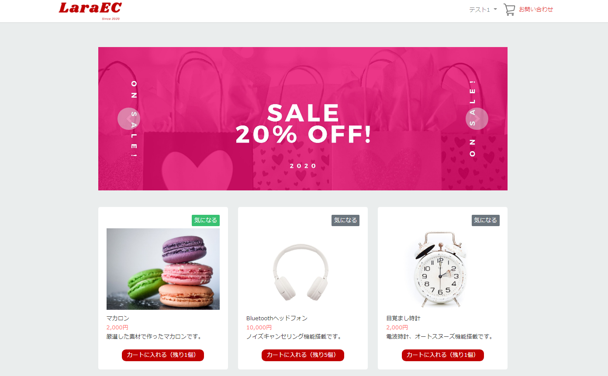
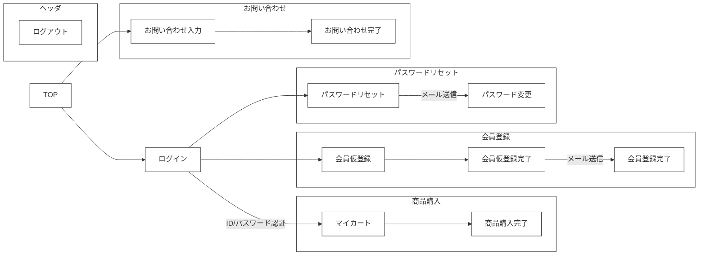
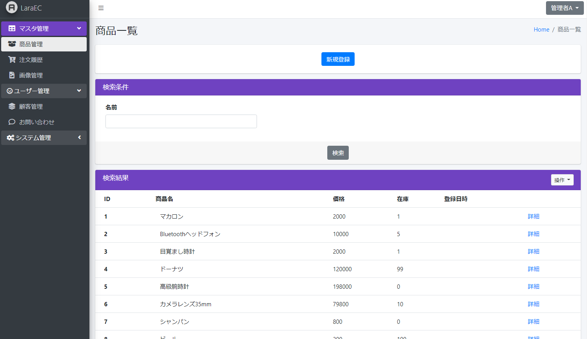

# 🌙 laravel-react-boilerplate


## 📗 プロジェクトの概要

Laravel 12 ＆ React 19 の学習用サンプルアプリケーションです。
Dockerを利用したクリーンな開発環境を提供し、ECサイトの基本機能を網羅しています。

### 対象としている方

* Laravel / React を最新バージョンで学習したい方
* Docker（Compose）を利用した標準的な開発環境を構築したい方
* ECサイトの決済（Stripe）や画像管理（S3/Minio）の実装例を見たい方
* マルチログイン認証（フロント/管理画面）を実装したい方
* ソーシャルログイン（Google）を導入してみたい方

### 利用している技術

#### インフラ

* **Apache 2.4**：自己証明書設定済み。SSL環境で動作します。
* **MySQL 8**：データ、設定、ログは外部参照可能にマウント。
* **Adminer**：DB管理ツール。
* **Mailpit**：メールキャッチツール。
* **Minio**：S3互換ストレージ。画像保存先として利用。

#### 使用しているライブラリ

* **Backend**: Laravel 12 / PHP 8.2+
* **Frontend**: React 19 / TypeScript / Tailwind CSS
* **Design**: AdminLTE 3 (管理画面) / Storybook (コンポーネント管理)

## 🌐 Demo

#### フロント画面（React）

[https://laraec.isystk.com](https://laraec.isystk.com)





#### 管理画面

[https://laraec.isystk.com/admin/](https://laraec.isystk.com/admin/)



#### バッチ処理

- 月別売上金額出力バッチ
- 商品画像アップロードバッチ

## 📦 ディレクトリ構造

```
.
├── app                 # Laravel アプリケーション (Domain層/Service層を分離)
├── bootstrap           # フレームワーク起動設定
├── config              # 各種設定ファイル
├── database            # Migration / Seeder
├── docker              # Docker設定ファイル (MySQL, Minio等)
├── documents           # 設計書・規約ドキュメント
├── public              # 公開ディレクトリ
├── resources           # Bladeビュー / 言語ファイル
│   └─── assets
│       ├── admin       # 管理画面用(AdminLTE)
│       └── front       # フロント画面(React)
├── routes              # ルーティング設定
├── storage             # ログ・キャッシュ・テスト出力
├── tests               # PHPUnit / Featureテスト
├── Makefile            # プロジェクト操作用コマンド集
└── package.json        # フロントエンド依存関係

```

## 🔧 開発環境の構築

事前に `docker`, `docker-compose` (または Docker Desktop) が動作する環境が必要です。

### Windowsの場合は、WSLを利用することを推奨します。
[https://docs.microsoft.com/ja-jp/windows/wsl/install](https://docs.microsoft.com/ja-jp/windows/wsl/install)

```
# PowerShellからWSLを起動する
$ wsl

# 初回起動時に、ユーザ名とパスワードが聞かれます。
# 何も入力せずにEnterを押すとroot ユーザーで利用できるようになるので、rootユーザーとして設定します。

# 初めにライブラリを最新化します。
$ apt update

# 日本語に対応しておきます。
$ apt -y install language-pack-ja
$ update-locale LANG=ja_JP.UTF8
$ apt -y install manpages-ja manpages-ja-dev
```

### Dockerを利用する為の準備

```
# DockerとDocker Composeをインストールする。
$ apt install -y docker-ce docker-compose
$ service docker start
```

### 1. Dockerの起動

プロジェクトの操作はすべて **Makefile** に集約されています。

```bash
# コマンド一覧を表示して確認
$ make help

# 初期化処理（初回のみ、または環境をフルリセットしたい場合）
$ make init

# Dockerを起動して各サーバーを構築
$ make start

# サーバーの状態を確認
$ make ps

```

### 2. 初期設定・動作確認

```bash
# Webサーバー(appコンテナ)にログイン
$ make app-login

# コンテナ内での操作例
> php artisan photo_upload --run # テスト用画像をMinioにアップロード
> ./vendor/bin/phpunit           # テストの実行

# コンテナに入らずに実行する場合
$ make test                      # Lint, Static Analysis, Testing を一括実行

```

### 3. ブラウザでアクセス

* **フロント画面**: [http://localhost/](http://localhost/)
* **管理画面**: [http://localhost/admin/](http://localhost/admin/)

---

## 🚀 本番環境へのデプロイ

[AWS ECS (Fargate) デプロイガイド](docker/aws/README.md) をご覧ください。

----

## 🎧 外部ツール・サーバー

Docker起動後に以下のURLで利用可能です。

| ツール | URL | 用途 |
| --- | --- | --- |
| **Mailpit** | http://localhost:8025/ | 送信メールの確認 |
| **Minio** | http://localhost:9001 | S3互換ストレージ管理 (ID/PW: admin/password) |
| **Adminer** | http://localhost:8888/ | データベースGUI管理 |
| **Storybook** | http://localhost:6006/ | UIコンポーネントカタログ |

## 📖 ドキュメント

| 種類 | リンク |
| --- | --- |
| コーディング規約 | [Laravel 規約](./documents/laravel_cording_rule.md) / [React 規約](./documents/react_cording_rule.md) |
| 公式リファレンス | [Laravel 12](https://readouble.com/laravel/12.x/ja/releases.html) / [Tailwind CSS](https://v3.tailwindcss.com/docs/) |

## 🎫 Licence

[MIT](https://github.com/isystk/laravel-react-boilerplate/blob/master/LICENSE)

## 👀 Author

[isystk](https://github.com/isystk)
