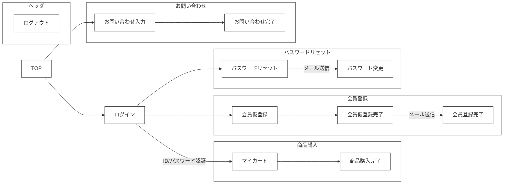

🌙 laravel-react-boilerplate
====

[](https://circleci.com/gh/circleci/circleci-docs)


## 📗 プロジェクトの概要

Laravel ＆ React.js の学習用サンプルアプリケーションです。

### 対象としている方
- Laravelを初めて学習してみたい方
- Dockerを利用したLaravelの開発環境を構築したい方
- ECサイトを学習してみたい方
- 管理画面も作成（マルチログイン）を作成したい方
- Stripeを利用した決算処理を作成してみたい方
- ソーシャルログインを作成してみたい方
- オブジェクトストレージへの画像アップロードを作成してみたい方
- フロントエンドをReact.jsで作成してみたい方

### 利用している技術

#### ■ インフラ
- Apache 2.4.46　・・・　WebサーバーとしてApacheを採用しました。自己証明書を設定済みなので開発環境でSSLとして動作可能です。
- MySQL 8　・・・　DBサーバーにはMySQLを採用しました。データファイルや設定ファイル、 ログなどはコンテナの外に出して 開発時に参照出来るようにしています。
- phpMyAdmin　・・・　起動したMySQLのデータを参照・編集するためのツールです。
- MailHog 　・・・　ダミーのSMTPサーバーです。送信したメールをブラウザで閲覧することが可能です。実際にはメールは送信されないので開発時の誤送信してしまう心配がありません。
- Minio 　・・・　S3に完全互換性のあるオブジェクトストレージです。アップロードした画像の保存先として利用しています。
- Redis 　・・・　永続化可能なインメモリデータベースです。DBから取得したデータのキャッシュとして利用しています。

#### ■ アプリケーション

- Laravel 12
- React 18
- Typescript
- Adminlte 3
- Bootstrap 4

## 🌐 Demo

#### ■ フロント画面（React）

https://laraec.isystk.com/


- ログイン/ログアウト
- 会員登録
- パスワードリマインダ
- 商品一覧
- カートに追加
- 決算処理（Stripe）
- お気に入り追加
- お問い合わせ
- ソーシャルログイン（Google）



#### ■ 管理画面（Bootstrap）

https://laraec.isystk.com/admin/


- ログイン/ログアウト
- 商品管理
- 注文履歴
- 顧客管理
- お問い合わせ管理
- 画像管理
- CSVダウンロード
- PDFダウンロード
- 画像アップロード

#### ■ バッチ処理

- 商品CSV出力バッチ
- S3商品画像アップロードバッチ

## 🔧 開発環境の構築

※ この環境を利用する為には、事前にdocker、docker-composeが動作する状態であることが前提条件です。
Github CodeSpace を利用する場合は、Dockerの起動から進めてください。

### WSLのインストール（Windowsの場合）
参考
https://docs.microsoft.com/ja-jp/windows/wsl/install

WSLでUbuntuを起動する
```
# 初回起動時に、ユーザ名とパスワードが聞かれます。
# 何も入力せずにEnterを押すとroot ユーザーで利用できるようになるので、rootユーザーとして設定します。

# 初めにライブラリを最新化します。
$ apt update

# 日本語に対応しておきます。
$ apt -y install language-pack-ja
$ update-locale LANG=ja_JP.UTF8
$ apt -y install manpages-ja manpages-ja-dev
```

### Dockerを利用できるようにする

```
# DockerとDocker Composeをインストールする。
$ apt install -y docker-ce docker-compose
$ service docker start
```

## 📦 ディレクトリ構造

```
.
├── .circleci
│   └── config.yml
├── app
│   ├── Console (バッチ)
│   ├── Domain（ドメイン層）
│   │   ├── Entities（エンティティ）
│   │   └── Repositories（リポジトリー）
│   ├── Enums (定数)
│   ├── Exceptions (例外処理)
│   ├── FileIO (インポート・エクスポート)
│   ├── Http （プレゼンテーション層）
│   ├── Jobs （Job Queue）
│   ├── Mail （メール）
│   ├── Observers （オブサーバー）
│   ├── Providers（サービスプロバイダー）
│   ├── Services（ビジネスロジック）
│   └── Utils（共通ユーティル）
├── bootstrap
│   ├── app.php
│   ├── cache
│   └── providers.php
├── config
│   ├── app.php
│   ├── auth.php
│   ├── breadcrumbs.php
│   ├── cache.php
│   ├── const.php
│   ├── database.php
│   ├── filesystems.php
│   ├── logging.php
│   ├── mail.php
│   ├── queue.php
│   ├── services.php
│   └── session.php
├── database
│   ├── factories
│   ├── migrations
│   └── seeders
├── documents（ドキュメント関連）
├── public
│   ├── .htaccess
│   ├── assets
│   │   ├── admin（管理画面用のJavaScript、SASS）
│   │   └── front（フロント画面用のTypeScript,SASS）
│   ├── build
│   ├── favicon.ico
│   ├── index.php
│   └── robots.txt
├── resources
│   ├── assets
│   ├── lang
│   └── views
├── routes
│   ├── breadcrumbs
│   ├── console.php
│   └── web.php
├── storage
│   ├── app
│   ├── framework
│   ├── logs
│   └── test
├── tests
│   ├── Feature
│   ├── TestCase.php
│   └── Unit
└── dc.sh （Dockerの起動用スクリプト）
```

## 🖊️ Docker 操作用シェルスクリプトの使い方

```
Usage:
  dc.sh [command] [<options>]

Options:
  stats|st                 Dockerコンテナの状態を表示します。
  logs                     Dockerコンテナのログを表示します。
  init                     Dockerコンテナ・イメージ・生成ファイルの状態を初期化します。
  start                    すべてのDaemonを起動します。
  stop                     すべてのDaemonを停止します。
  apache restart           Apacheを再起動します。
  mysql login              MySQLデータベースにログインします。
  mysql export <PAHT>      MySQLデータベースのdumpファイルをエクスポートします。
  mysql import <PAHT>      MySQLデータベースにdumpファイルをインポートします。
  php login                PHP-FPMのサーバーにログインします。
  php test                 Laravelのテストコードを実行します。
  --version, -v     バージョンを表示します。
  --help, -h        ヘルプを表示します。
```

### mailhog 
ダミーのメールサーバーです。実際にはメールは送信されず、送信されたメールはブラウザで閲覧できます。
Dockerを起動後に以下のURLにアクセスすると利用可能です。

http://localhost:8025/

### minio
S3に準拠したダミーのオブジェクトストレージです。
Dockerを起動後に以下のURLにアクセスすると利用可能です。

http://localhost:9001


### phpMyAdmin
データベースに接続してデータの参照や編集が可能です。
Dockerを起動後に以下のURLにアクセスすると利用可能です。

http://localhost:8888/

## 💬 使い方

各種デーモンを起動する
```
# 下準備（初回のみ）
$ ./dc.sh init

# Dockerでローカル環境に各種デーモンを構築・起動する
$ ./dc.sh start

# データベースとPHPが立ち上がるまで少し待ちます。(初回は5分程度)

# MySQLにログインしてみる
$ ./dc.sh mysql login

# PHPサーバーにログインしてみる
$ ./dc.sh php login
```

minioにバケットを作成して、外部アクセス可能な状態にする。

[こちら](http://localhost:9001/)から以下のID/パスワードでログイン後、「laraec.isystk.com」という名前のバケットを作成します。
作成後、Manage から Access Policy を「Public」に変更してバケット内ファイルを外部参照可能な状態に公開します。

| Username | Password
|----------|----
| admin    | password


バックエンド環境を構築する
```
# PHPサーバーにログインしてみる（composer や artisan などのコマンドは基本的にここで行う）
$ ./dc.sh php login

# Larastan を実行してコードをチェックする
> ./vendor/bin/phpstan analyse --memory-limit=1G

# PHPUnit でテストコードを実行する
> ./vendor/bin/phpunit tests

# テスト用の商品画像をS3（Minio）にアップロード
> php artisan s3upload
```

動作確認
```
# ブラウザでアクセス（フロント）
https://localhost/

# ブラウザでアクセス（管理画面）
https://localhost/admin/

# サーバーを停止する場合
$ ./dc.sh stop
```

## 🎨 参考

| プロジェクト                                                                                           | 概要                               |
|:-------------------------------------------------------------------------------------------------|:---------------------------------|
| [Laravel12公式ドキュメント](https://readouble.com/laravel/12.x/ja/releases.html)                         | Laravel11公式ドキュメントです。             |
| [React Hooks 全19種の解説とサンプル](https://isystk.github.io/react19-hook-study/study)                 | Laravel11以降から使い始めた人に必要そうな質問と回答一覧 |


## 🎫 Licence

[MIT](https://github.com/isystk/laravel-react-boilerplate/blob/master/LICENSE)

## 👀 Author

[isystk](https://github.com/isystk)
