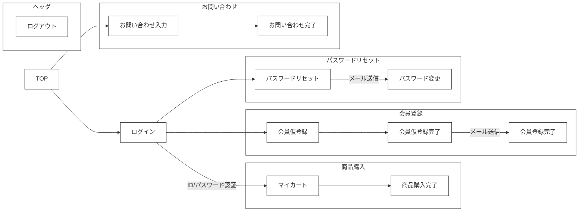
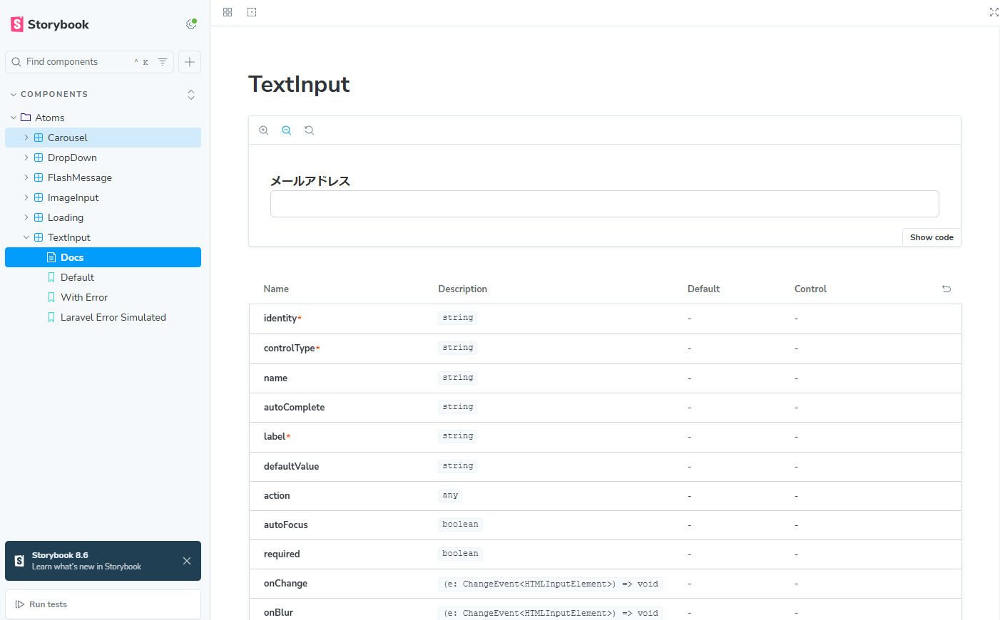

🌙 laravel-react-boilerplate
====


## 📗 プロジェクトの概要

Laravel ＆ React.js の学習用サンプルアプリケーションです。

### 対象としている方
- Laravelを初めて学習してみたい方
- Dockerを利用したLaravelの開発環境を構築したい方
- ECサイトを学習してみたい方
- フロントと管理画面で認証を別けたい（マルチログイン）をしたい方
- Stripeを利用した決算処理を作成してみたい方
- ソーシャルログインを作成してみたい方
- 画像の管理をS3などのオブジェクトストレージにしたい方
- フロントエンドをReact.jsで作成してみたい方

### 利用している技術

#### インフラ
- Apache 2.4.46　・・・　WebサーバーとしてApacheを採用しました。自己証明書を設定済みなので開発環境でSSLとして動作可能です。
- MySQL 8　・・・　DBサーバーにはMySQLを採用しました。データファイルや設定ファイル、 ログなどはコンテナの外に出して 開発時に参照出来るようにしています。
- adminer　・・・　起動したMySQLのデータを参照・編集するためのツールです。
- mailpit 　・・・　ダミーのSMTPサーバーです。送信したメールをブラウザで閲覧することが可能です。実際にはメールは送信されないので開発時の誤送信してしまう心配がありません。
- Minio 　・・・　S3に完全互換性のあるオブジェクトストレージです。アップロードした画像の保存先として利用しています。

#### 使用しているライブラリ

- Laravel 12
- React 19
- Typescript
- Adminlte 3

## 🌐 Demo

#### フロント画面（React）

https://laraec.isystk.com/


- ログイン/ログアウト
- 会員登録
- パスワードリマインダ
- 商品一覧
- カートに追加
- 決算処理（Stripe）
- お気に入り追加
- お問い合わせ
- ソーシャルログイン（Google）



#### 管理画面（Bootstrap）

https://laraec.isystk.com/admin/


- ログイン/ログアウト
- 商品管理
- 注文履歴
- 顧客管理
- お問い合わせ管理
- 画像管理
- CSVダウンロード
- PDFダウンロード
- 画像アップロード

#### バッチ処理

- 月別売上金額出力バッチ
- S3商品画像アップロードバッチ


## 📦 ディレクトリ構造

```
.
├── .circleci
│   └── config.yml
├── app
│   ├── Console (バッチ)
│   ├── Domain（ドメイン層）
│   │   ├── Entities（エンティティ）
│   │   └── Repositories（リポジトリー）
│   ├── Enums (定数)
│   ├── Exceptions (例外処理)
│   ├── FileIO (インポート・エクスポート)
│   ├── Http （プレゼンテーション層）
│   ├── Jobs （Job Queue）
│   ├── Mail （メール）
│   ├── Observers （オブサーバー）
│   ├── Providers（サービスプロバイダー）
│   ├── Services（ビジネスロジック）
│   └── Utils（共通ユーティル）
├── bootstrap
│   ├── app.php
│   ├── cache
│   └── providers.php
├── config
│   ├── app.php
│   ├── auth.php
│   ├── breadcrumbs.php
│   ├── cache.php
│   ├── const.php
│   ├── database.php
│   ├── filesystems.php
│   ├── logging.php
│   ├── mail.php
│   ├── queue.php
│   ├── services.php
│   └── session.php
├── database
│   ├── factories
│   ├── migrations
│   └── seeders
├── docker
│   ├── app
│   ├── docker-compose.yml
│   ├── mysql
│   └── adminer
├── documents（ドキュメント関連）
├── public
│   ├── .htaccess
│   ├── assets
│   │   ├── admin（管理画面用のJavaScript、SASS）
│   │   └── front（フロント画面用のTypeScript,SASS）
│   ├── build
│   ├── favicon.ico
│   ├── index.php
│   └── robots.txt
├── resources
│   ├── assets
│   ├── lang
│   └── views
├── routes
│   ├── breadcrumbs
│   ├── console.php
│   └── web.php
├── storage
│   ├── app
│   ├── framework
│   ├── logs
│   └── test
├── tests
│   ├── Feature
│   ├── TestCase.php
│   └── Unit
└── run.sh （Dockerの操作用スクリプト）
```

## 🔧 開発環境の構築

※ この環境を利用する為には、事前にdocker、docker-composeが動作する状態であることが前提条件です。
Github CodeSpace を利用する場合は、Dockerの起動から進めてください。

### WSLのインストール（Windowsの場合）
参考
https://docs.microsoft.com/ja-jp/windows/wsl/install

WSLでUbuntuを起動する
```
# 初回起動時に、ユーザ名とパスワードが聞かれます。
# 何も入力せずにEnterを押すとroot ユーザーで利用できるようになるので、rootユーザーとして設定します。

# 初めにライブラリを最新化します。
$ apt update

# 日本語に対応しておきます。
$ apt -y install language-pack-ja
$ update-locale LANG=ja_JP.UTF8
$ apt -y install manpages-ja manpages-ja-dev
```

### Dockerを利用する為の準備

```
# DockerとDocker Composeをインストールする。
$ apt install -y docker-ce docker-compose
$ service docker start
```

### Dockerを起動する

```
# 初期化処理（初回のみ、環境をリセットしたい場合に実行する）
$ ./run.sh init

# Dockerを起動して各サーバーを構築する
$ ./run.sh start

# サーバーが立ち上がるまで少し待ちます。(初回は5分程度)

# MySQLにログインしてみる
$ ./run.sh mysql login

# Webサーバーにログインしてみる
$ ./run.sh app login

# 起動に問題がある場合は、以下のコマンドで状況を確認してみてください。
$ ./run.sh st
$ ./run.sh logs
```

### 動作を確認する
```
# Webサーバーにログインする（composer や npm などのコマンドは基本的にここで行う）
$ ./run.sh app login

# Larastan を実行してコードをチェックする
> ./vendor/bin/phpstan analyse --memory-limit=1G

# PHPUnit でテストコードを実行する
> ./vendor/bin/phpunit tests

# React のテストコードを実行する
> npm run test

# テスト用の商品画像をS3（Minio）にアップロード
> php artisan s3upload
```

ブラウザでアクセス（フロント）

https://localhost/

ブラウザでアクセス（管理画面）

https://localhost/admin/


サーバーを停止する場合
```
$ ./run.sh stop
```

## 🎧 利用可能なサーバー

### mailpit 
ダミーのメールサーバーです。実際にはメールは送信されず、送信されたメールはブラウザで閲覧できます。
Dockerを起動後に以下のURLにアクセスすると利用可能です。

http://localhost:8025/

### minio
S3に準拠したダミーのオブジェクトストレージです。
Dockerを起動後に以下のURLにアクセスすると利用可能です。

http://localhost:9001

以下のID/パスワードでログインが可能です。「laraec.isystk.com」という名前のバケットが存在します。
Access Policy を「Public」にしているので外部から参照可能に公開されています。

| Username | Password
|----------|---------
| admin    | password


### adminer
データベースに接続してデータの参照や編集が可能です。
Dockerを起動後に以下のURLにアクセスすると利用可能です。

http://localhost:8888/

### storybook
Reactで作成されたコンポーネントの確認が可能です。
Dockerを起動後に以下のURLにアクセスすると利用可能です。

http://localhost:6006/



## 📖 ドキュメント

| 種類         | リンク                                                                                |
|:-----------|:-----------------------------------------------------------------------------------|
| コーディング規約   | [Laravel コーディング規約](./documents/laravel_cording_rule.md)                                |
| コーディング規約   | [React コーディング規約](./documents/react_cording_rule.md)                                |
| 公式サイト      | [Laravel12公式ドキュメント](https://readouble.com/laravel/12.x/ja/releases.html)           |
| 公式サイト      | [Tailwind CSS ドキュメント](https://v3.tailwindcss.com/docs/)                            |
| 参考サイト      | [React Hooks 全19種の解説とサンプル](https://isystk.github.io/react19-hook-study/study) |


## 🎫 Licence

[MIT](https://github.com/isystk/laravel-react-boilerplate/blob/master/LICENSE)

## 👀 Author

[isystk](https://github.com/isystk)
