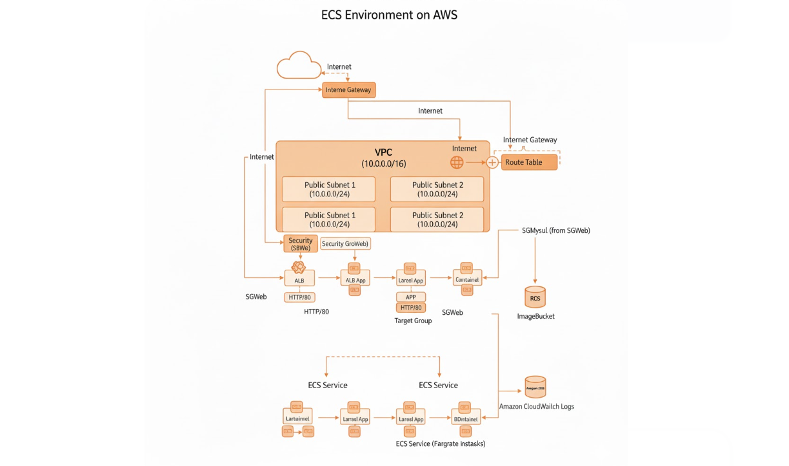

# AWS ECS (Fargate) デプロイガイド

LaravelアプリケーションをDocker化し、AWS（ECS Fargate / Aurora MySQL）環境へデプロイ・運用するための手順書です。

### インフラ構成図



## 1. 前提条件

* **AWS 認証情報**: `.env` ファイルに適切な権限を持つアクセスキーが設定されていること
* **Docker**: `docker` 及び `docker-compose` がインストールされていること
* **Make**: コマンド実行の簡略化に使用

---

## 2. デプロイ・フロー

### Phase 1: Dockerイメージの準備

ECRリポジトリを作成し、本番用イメージをプッシュします。

```bash
# 1. ECRリポジトリの作成（初回のみ）
make awscli
# (コンテナ内)
aws ecr create-repository --repository-name laraec-app --region ap-northeast-1
exit

# 2. 本番イメージのビルドとプッシュ
make aws-build

# 3. 本番イメージの動作テスト（ローカル）
# ※ コンテナ内のアプリケーションは、ローカルの docker-compose で起動したネットワーク上で動作します。
# ※ 本番用イメージで正しく Apache が起動し、DB接続エラーが出ないかを確認するための工程です。
make aws-test

```

### Phase 2: インフラ構築 (CloudFormation)

VPC、ALB、Aurora、ECSの一連のリソースを構築します。

```bash
# スタックの作成・展開
make aws-deploy

```

### Phase 3: データベースの初期化

ECS Execを使用して、AWS上で稼働しているコンテナ内でマイグレーション等を実行します。

```bash
# 1. AWS操作用コンテナへ
make awscli

# 2. (コンテナ内) 実行中のタスクIDを取得してECSコンテナに潜入
CLUSTER_NAME="laraec-app-dev-cluster"; \
SERVICE_NAME="laraec-app-dev-service"; \
TASK_ID=$(aws ecs list-tasks --cluster $CLUSTER_NAME --service-name $SERVICE_NAME --query 'taskArns[0]' --output text | cut -d'/' -f3); \
aws ecs execute-command --cluster $CLUSTER_NAME --task $TASK_ID --container app --interactive --command "/bin/bash"

# 3. (ECSコンテナ内) マイグレーションとデータ投入
php artisan migrate --force
php artisan db:seed --force

# 4. (ECSコンテナ内) 動作確認用の画像をS3にアップロード
php artisan photo_upload --run
exit

# 4. (コンテナ内) ALBのパブリックIPを取得し、ブラウザでアクセスします。
ALB_NAME="laraec-app-dev-alb"; \
ALB_URL=$(aws elbv2 describe-load-balancers \
  --names $ALB_NAME \
  --query "LoadBalancers[0].DNSName" \
  --output text); \
echo "🌐 Laravel App URL: http://$ALB_URL"

```

---

## 3. アプリケーションの更新

コード修正を行い、ECRへ最新イメージをプッシュした後は、以下の手順でサービスを更新します。

```bash
# 1. 最新イメージのビルドとプッシュ
make aws-build

# 2. AWS操作用コンテナへ
make awscli

# 3. (コンテナ内) サービスの強制更新と待機
aws ecs update-service \
  --cluster laraec-app-dev-cluster \
  --service laraec-app-dev-service \
  --force-new-deployment

aws ecs wait services-stable \
  --cluster laraec-app-dev-cluster \
  --services laraec-app-dev-service

```

---

## 4. コスト目安 (月額)

最小構成での推定コストです（1ドル=150円換算）。

| サービス | スペック | 月額目安 | 備考 |
| --- | --- | --- | --- |
| **ECS Fargate** | 0.25 vCPU / 0.5 GB | 約$15 | 1タスク常時起動 |
| **Aurora MySQL** | db.t3.small | 約$50 | 最小クラス |
| **NAT Gateway** | 1基 | 約$33 | **固定費の主要因** |
| **その他** | Logs, Transfer | 約$2 | 利用量による |
| **合計** |  | **約$100 (約15,000円)** |  |

---

## 5. リソースの削除

検証終了後は、余計な課金を防ぐためにスタックを削除してください。

> [!CAUTION]
> DB内のデータもすべて削除されます。

```bash
make aws-destroy

```
