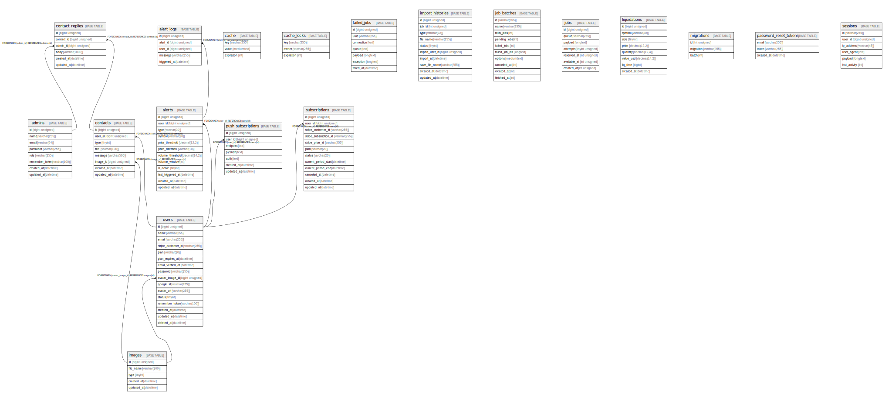

# musashi-trade

## Tables

| Name | Columns | Comment | Type |
| ---- | ------- | ------- | ---- |
| [admins](admins.md) | 8 | 管理者 | BASE TABLE |
| [alert_logs](alert_logs.md) | 5 | アラート通知履歴 | BASE TABLE |
| [alerts](alerts.md) | 12 | アラート設定 | BASE TABLE |
| [cache](cache.md) | 3 |  | BASE TABLE |
| [cache_locks](cache_locks.md) | 3 |  | BASE TABLE |
| [contact_replies](contact_replies.md) | 6 | お問い合わせ返信 | BASE TABLE |
| [contacts](contacts.md) | 8 | お問い合わせ | BASE TABLE |
| [failed_jobs](failed_jobs.md) | 7 |  | BASE TABLE |
| [images](images.md) | 5 | 画像 | BASE TABLE |
| [import_histories](import_histories.md) | 10 |  | BASE TABLE |
| [job_batches](job_batches.md) | 10 |  | BASE TABLE |
| [jobs](jobs.md) | 7 |  | BASE TABLE |
| [liquidations](liquidations.md) | 8 | 清算データ | BASE TABLE |
| [migrations](migrations.md) | 3 |  | BASE TABLE |
| [password_reset_tokens](password_reset_tokens.md) | 3 |  | BASE TABLE |
| [push_subscriptions](push_subscriptions.md) | 7 | ブラウザプッシュ通知購読 | BASE TABLE |
| [sessions](sessions.md) | 6 |  | BASE TABLE |
| [subscriptions](subscriptions.md) | 12 | サブスクリプション | BASE TABLE |
| [users](users.md) | 16 |  | BASE TABLE |

## Relations

---

> Generated by [tbls](https://github.com/k1LoW/tbls)
