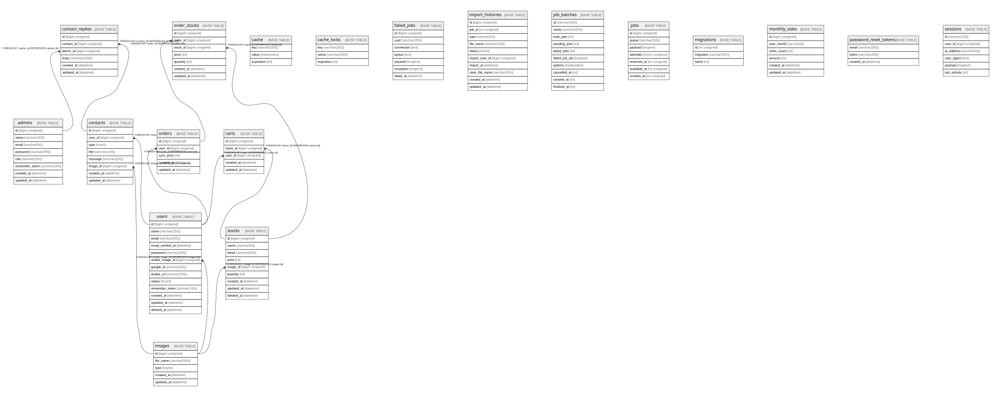

# laraec

## Tables

| Name | Columns | Comment | Type |
| ---- | ------- | ------- | ---- |
| [admins](admins.md) | 8 | 管理者 | BASE TABLE |
| [cache](cache.md) | 3 |  | BASE TABLE |
| [cache_locks](cache_locks.md) | 3 |  | BASE TABLE |
| [carts](carts.md) | 5 | カート | BASE TABLE |
| [contact_replies](contact_replies.md) | 6 | お問い合わせ返信 | BASE TABLE |
| [contacts](contacts.md) | 8 | お問い合わせ | BASE TABLE |
| [failed_jobs](failed_jobs.md) | 7 |  | BASE TABLE |
| [images](images.md) | 5 | 画像 | BASE TABLE |
| [import_histories](import_histories.md) | 10 |  | BASE TABLE |
| [job_batches](job_batches.md) | 10 |  | BASE TABLE |
| [jobs](jobs.md) | 7 |  | BASE TABLE |
| [migrations](migrations.md) | 3 |  | BASE TABLE |
| [monthly_sales](monthly_sales.md) | 6 | 月別売上 | BASE TABLE |
| [order_stocks](order_stocks.md) | 7 | 注文商品 | BASE TABLE |
| [orders](orders.md) | 5 | 注文 | BASE TABLE |
| [password_reset_tokens](password_reset_tokens.md) | 3 |  | BASE TABLE |
| [sessions](sessions.md) | 6 |  | BASE TABLE |
| [stocks](stocks.md) | 9 | 商品 | BASE TABLE |
| [users](users.md) | 13 |  | BASE TABLE |

## Relations

---

> Generated by [tbls](https://github.com/k1LoW/tbls)
