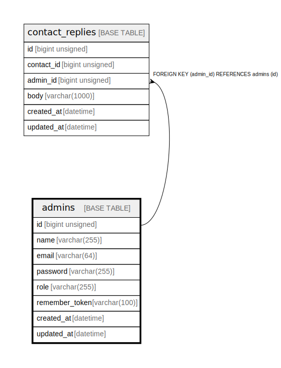

# admins

## Description

管理者

<details>
<summary><strong>Table Definition</strong></summary>

```sql
CREATE TABLE `admins` (
  `id` bigint unsigned NOT NULL AUTO_INCREMENT,
  `name` varchar(255) COLLATE utf8mb4_unicode_ci NOT NULL COMMENT '管理者名',
  `email` varchar(64) COLLATE utf8mb4_unicode_ci NOT NULL COMMENT 'メールアドレス',
  `password` varchar(255) COLLATE utf8mb4_unicode_ci NOT NULL COMMENT 'パスワード',
  `role` varchar(255) COLLATE utf8mb4_unicode_ci NOT NULL DEFAULT 'manager' COMMENT '権限名',
  `remember_token` varchar(100) COLLATE utf8mb4_unicode_ci DEFAULT NULL,
  `created_at` datetime NOT NULL,
  `updated_at` datetime NOT NULL,
  PRIMARY KEY (`id`),
  UNIQUE KEY `admins_email_unique` (`email`)
) ENGINE=InnoDB AUTO_INCREMENT=[Redacted by tbls] DEFAULT CHARSET=utf8mb4 COLLATE=utf8mb4_unicode_ci COMMENT='管理者'
```

</details>

## Columns

| Name | Type | Default | Nullable | Extra Definition | Children | Parents | Comment |
| ---- | ---- | ------- | -------- | ---------------- | -------- | ------- | ------- |
| id | bigint unsigned |  | false | auto_increment | [contact_replies](contact_replies.md) |  |  |
| name | varchar(255) |  | false |  |  |  | 管理者名 |
| email | varchar(64) |  | false |  |  |  | メールアドレス |
| password | varchar(255) |  | false |  |  |  | パスワード |
| role | varchar(255) | manager | false |  |  |  | 権限名 |
| remember_token | varchar(100) |  | true |  |  |  |  |
| created_at | datetime |  | false |  |  |  |  |
| updated_at | datetime |  | false |  |  |  |  |

## Constraints

| Name | Type | Definition |
| ---- | ---- | ---------- |
| admins_email_unique | UNIQUE | UNIQUE KEY admins_email_unique (email) |
| PRIMARY | PRIMARY KEY | PRIMARY KEY (id) |

## Indexes

| Name | Definition |
| ---- | ---------- |
| PRIMARY | PRIMARY KEY (id) USING BTREE |
| admins_email_unique | UNIQUE KEY admins_email_unique (email) USING BTREE |

## Relations



---

> Generated by [tbls](https://github.com/k1LoW/tbls)
