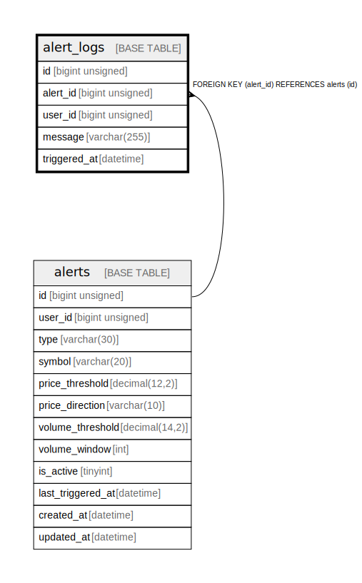

# alert_logs

## Description

アラート通知履歴

<details>
<summary><strong>Table Definition</strong></summary>

```sql
CREATE TABLE `alert_logs` (
  `id` bigint unsigned NOT NULL AUTO_INCREMENT COMMENT 'アラート通知履歴ID',
  `alert_id` bigint unsigned NOT NULL COMMENT 'アラートID',
  `user_id` bigint unsigned NOT NULL COMMENT 'ユーザーID',
  `message` varchar(255) COLLATE utf8mb4_unicode_ci NOT NULL COMMENT 'メッセージ',
  `triggered_at` datetime NOT NULL COMMENT '発火日時',
  PRIMARY KEY (`id`),
  KEY `idx_alert_id` (`alert_id`),
  KEY `idx_user_id_triggered` (`user_id`,`triggered_at`),
  CONSTRAINT `alert_logs_alert_id_foreign` FOREIGN KEY (`alert_id`) REFERENCES `alerts` (`id`) ON DELETE CASCADE
) ENGINE=InnoDB DEFAULT CHARSET=utf8mb4 COLLATE=utf8mb4_unicode_ci COMMENT='アラート通知履歴'
```

</details>

## Columns

| Name | Type | Default | Nullable | Extra Definition | Children | Parents | Comment |
| ---- | ---- | ------- | -------- | ---------------- | -------- | ------- | ------- |
| id | bigint unsigned |  | false | auto_increment |  |  | アラート通知履歴ID |
| alert_id | bigint unsigned |  | false |  |  | [alerts](alerts.md) | アラートID |
| user_id | bigint unsigned |  | false |  |  |  | ユーザーID |
| message | varchar(255) |  | false |  |  |  | メッセージ |
| triggered_at | datetime |  | false |  |  |  | 発火日時 |

## Constraints

| Name | Type | Definition |
| ---- | ---- | ---------- |
| alert_logs_alert_id_foreign | FOREIGN KEY | FOREIGN KEY (alert_id) REFERENCES alerts (id) |
| PRIMARY | PRIMARY KEY | PRIMARY KEY (id) |

## Indexes

| Name | Definition |
| ---- | ---------- |
| idx_alert_id | KEY idx_alert_id (alert_id) USING BTREE |
| idx_user_id_triggered | KEY idx_user_id_triggered (user_id, triggered_at) USING BTREE |
| PRIMARY | PRIMARY KEY (id) USING BTREE |

## Relations



---

> Generated by [tbls](https://github.com/k1LoW/tbls)
