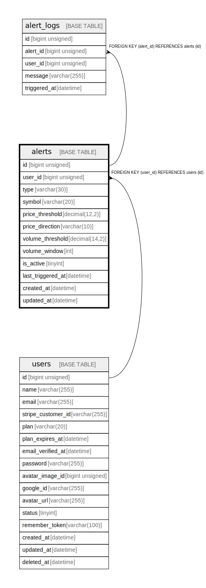

# alerts

## Description

アラート設定

<details>
<summary><strong>Table Definition</strong></summary>

```sql
CREATE TABLE `alerts` (
  `id` bigint unsigned NOT NULL AUTO_INCREMENT COMMENT 'アラートID',
  `user_id` bigint unsigned NOT NULL COMMENT 'ユーザーID',
  `type` varchar(30) COLLATE utf8mb4_unicode_ci NOT NULL COMMENT 'アラート種別',
  `symbol` varchar(20) COLLATE utf8mb4_unicode_ci NOT NULL DEFAULT 'BTCUSDT' COMMENT 'シンボル',
  `price_threshold` decimal(12,2) DEFAULT NULL COMMENT '価格閾値',
  `price_direction` varchar(10) COLLATE utf8mb4_unicode_ci DEFAULT NULL COMMENT '価格方向',
  `volume_threshold` decimal(14,2) DEFAULT NULL COMMENT 'ボリューム閾値',
  `volume_window` int DEFAULT NULL COMMENT 'ボリューム集計時間窓',
  `is_active` tinyint NOT NULL DEFAULT '1' COMMENT '有効フラグ',
  `last_triggered_at` datetime DEFAULT NULL COMMENT '最終発火日時',
  `created_at` datetime NOT NULL COMMENT '作成日時',
  `updated_at` datetime NOT NULL COMMENT '更新日時',
  PRIMARY KEY (`id`),
  KEY `idx_user_id` (`user_id`),
  KEY `idx_is_active` (`is_active`),
  CONSTRAINT `alerts_user_id_foreign` FOREIGN KEY (`user_id`) REFERENCES `users` (`id`) ON DELETE CASCADE
) ENGINE=InnoDB AUTO_INCREMENT=[Redacted by tbls] DEFAULT CHARSET=utf8mb4 COLLATE=utf8mb4_unicode_ci COMMENT='アラート設定'
```

</details>

## Columns

| Name | Type | Default | Nullable | Extra Definition | Children | Parents | Comment |
| ---- | ---- | ------- | -------- | ---------------- | -------- | ------- | ------- |
| id | bigint unsigned |  | false | auto_increment | [alert_logs](alert_logs.md) |  | アラートID |
| user_id | bigint unsigned |  | false |  |  | [users](users.md) | ユーザーID |
| type | varchar(30) |  | false |  |  |  | アラート種別 |
| symbol | varchar(20) | BTCUSDT | false |  |  |  | シンボル |
| price_threshold | decimal(12,2) |  | true |  |  |  | 価格閾値 |
| price_direction | varchar(10) |  | true |  |  |  | 価格方向 |
| volume_threshold | decimal(14,2) |  | true |  |  |  | ボリューム閾値 |
| volume_window | int |  | true |  |  |  | ボリューム集計時間窓 |
| is_active | tinyint | 1 | false |  |  |  | 有効フラグ |
| last_triggered_at | datetime |  | true |  |  |  | 最終発火日時 |
| created_at | datetime |  | false |  |  |  | 作成日時 |
| updated_at | datetime |  | false |  |  |  | 更新日時 |

## Constraints

| Name | Type | Definition |
| ---- | ---- | ---------- |
| alerts_user_id_foreign | FOREIGN KEY | FOREIGN KEY (user_id) REFERENCES users (id) |
| PRIMARY | PRIMARY KEY | PRIMARY KEY (id) |

## Indexes

| Name | Definition |
| ---- | ---------- |
| idx_is_active | KEY idx_is_active (is_active) USING BTREE |
| idx_user_id | KEY idx_user_id (user_id) USING BTREE |
| PRIMARY | PRIMARY KEY (id) USING BTREE |

## Relations



---

> Generated by [tbls](https://github.com/k1LoW/tbls)
