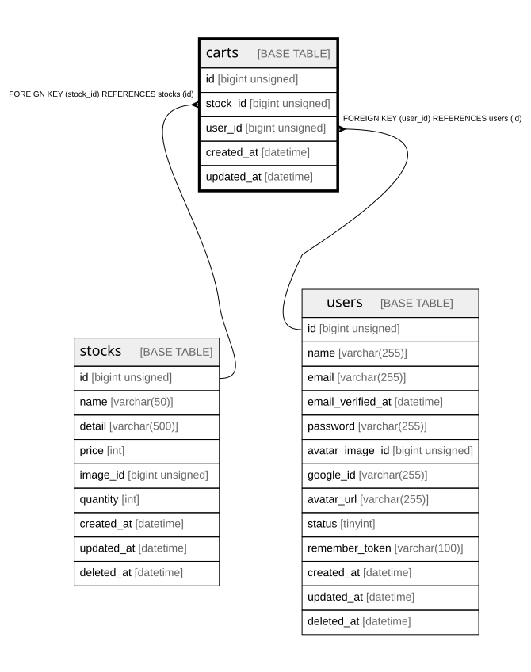

# carts

## Description

カート

<details>
<summary><strong>Table Definition</strong></summary>

```sql
CREATE TABLE `carts` (
  `id` bigint unsigned NOT NULL AUTO_INCREMENT,
  `stock_id` bigint unsigned NOT NULL,
  `user_id` bigint unsigned NOT NULL,
  `created_at` datetime NOT NULL,
  `updated_at` datetime NOT NULL,
  PRIMARY KEY (`id`),
  KEY `carts_stock_id_foreign` (`stock_id`),
  KEY `carts_user_id_foreign` (`user_id`),
  CONSTRAINT `carts_stock_id_foreign` FOREIGN KEY (`stock_id`) REFERENCES `stocks` (`id`),
  CONSTRAINT `carts_user_id_foreign` FOREIGN KEY (`user_id`) REFERENCES `users` (`id`)
) ENGINE=InnoDB DEFAULT CHARSET=utf8mb4 COLLATE=utf8mb4_unicode_ci COMMENT='カート'
```

</details>

## Columns

| Name | Type | Default | Nullable | Extra Definition | Children | Parents | Comment |
| ---- | ---- | ------- | -------- | ---------------- | -------- | ------- | ------- |
| id | bigint unsigned |  | false | auto_increment |  |  |  |
| stock_id | bigint unsigned |  | false |  |  | [stocks](stocks.md) |  |
| user_id | bigint unsigned |  | false |  |  | [users](users.md) |  |
| created_at | datetime |  | false |  |  |  |  |
| updated_at | datetime |  | false |  |  |  |  |

## Constraints

| Name | Type | Definition |
| ---- | ---- | ---------- |
| carts_stock_id_foreign | FOREIGN KEY | FOREIGN KEY (stock_id) REFERENCES stocks (id) |
| carts_user_id_foreign | FOREIGN KEY | FOREIGN KEY (user_id) REFERENCES users (id) |
| PRIMARY | PRIMARY KEY | PRIMARY KEY (id) |

## Indexes

| Name | Definition |
| ---- | ---------- |
| carts_stock_id_foreign | KEY carts_stock_id_foreign (stock_id) USING BTREE |
| carts_user_id_foreign | KEY carts_user_id_foreign (user_id) USING BTREE |
| PRIMARY | PRIMARY KEY (id) USING BTREE |

## Relations



---

> Generated by [tbls](https://github.com/k1LoW/tbls)
