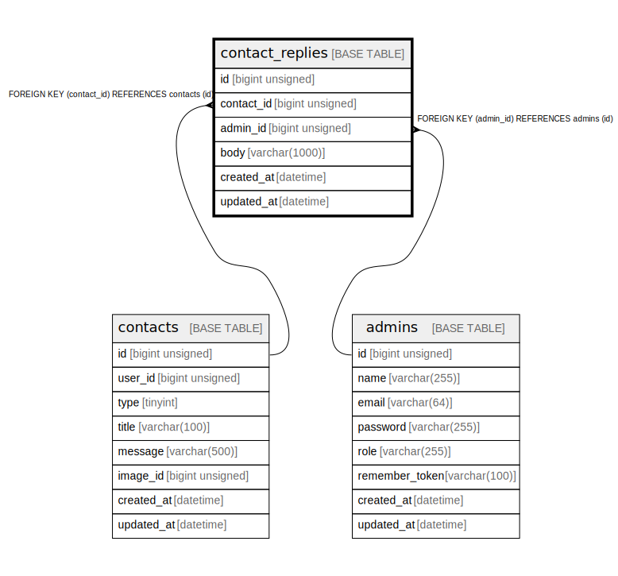

# contact_replies

## Description

お問い合わせ返信

<details>
<summary><strong>Table Definition</strong></summary>

```sql
CREATE TABLE `contact_replies` (
  `id` bigint unsigned NOT NULL AUTO_INCREMENT,
  `contact_id` bigint unsigned NOT NULL,
  `admin_id` bigint unsigned NOT NULL,
  `body` varchar(1000) COLLATE utf8mb4_unicode_ci NOT NULL COMMENT '返信内容',
  `created_at` datetime NOT NULL,
  `updated_at` datetime NOT NULL,
  PRIMARY KEY (`id`),
  KEY `contact_replies_contact_id_foreign` (`contact_id`),
  KEY `contact_replies_admin_id_foreign` (`admin_id`),
  CONSTRAINT `contact_replies_admin_id_foreign` FOREIGN KEY (`admin_id`) REFERENCES `admins` (`id`) ON DELETE CASCADE,
  CONSTRAINT `contact_replies_contact_id_foreign` FOREIGN KEY (`contact_id`) REFERENCES `contacts` (`id`) ON DELETE CASCADE
) ENGINE=InnoDB AUTO_INCREMENT=[Redacted by tbls] DEFAULT CHARSET=utf8mb4 COLLATE=utf8mb4_unicode_ci COMMENT='お問い合わせ返信'
```

</details>

## Columns

| Name | Type | Default | Nullable | Extra Definition | Children | Parents | Comment |
| ---- | ---- | ------- | -------- | ---------------- | -------- | ------- | ------- |
| id | bigint unsigned |  | false | auto_increment |  |  |  |
| contact_id | bigint unsigned |  | false |  |  | [contacts](contacts.md) |  |
| admin_id | bigint unsigned |  | false |  |  | [admins](admins.md) |  |
| body | varchar(1000) |  | false |  |  |  | 返信内容 |
| created_at | datetime |  | false |  |  |  |  |
| updated_at | datetime |  | false |  |  |  |  |

## Constraints

| Name | Type | Definition |
| ---- | ---- | ---------- |
| contact_replies_admin_id_foreign | FOREIGN KEY | FOREIGN KEY (admin_id) REFERENCES admins (id) |
| contact_replies_contact_id_foreign | FOREIGN KEY | FOREIGN KEY (contact_id) REFERENCES contacts (id) |
| PRIMARY | PRIMARY KEY | PRIMARY KEY (id) |

## Indexes

| Name | Definition |
| ---- | ---------- |
| contact_replies_admin_id_foreign | KEY contact_replies_admin_id_foreign (admin_id) USING BTREE |
| contact_replies_contact_id_foreign | KEY contact_replies_contact_id_foreign (contact_id) USING BTREE |
| PRIMARY | PRIMARY KEY (id) USING BTREE |

## Relations



---

> Generated by [tbls](https://github.com/k1LoW/tbls)
