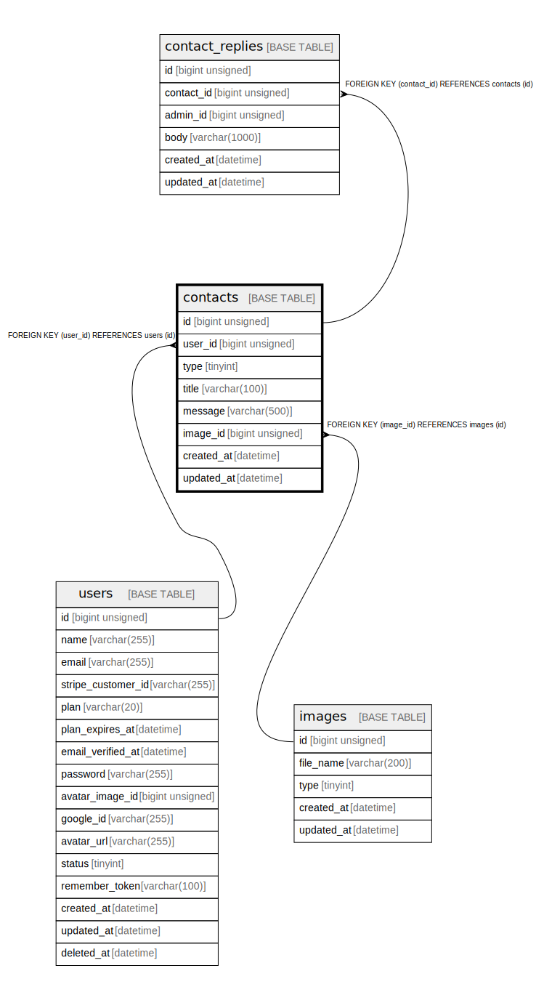

# contacts

## Description

お問い合わせ

<details>
<summary><strong>Table Definition</strong></summary>

```sql
CREATE TABLE `contacts` (
  `id` bigint unsigned NOT NULL AUTO_INCREMENT,
  `user_id` bigint unsigned NOT NULL,
  `type` tinyint NOT NULL COMMENT 'お問い合わせ種類',
  `title` varchar(100) COLLATE utf8mb4_unicode_ci NOT NULL COMMENT 'タイトル',
  `message` varchar(500) COLLATE utf8mb4_unicode_ci NOT NULL COMMENT 'お問い合わせ内容',
  `image_id` bigint unsigned DEFAULT NULL,
  `created_at` datetime NOT NULL,
  `updated_at` datetime NOT NULL,
  PRIMARY KEY (`id`),
  KEY `contacts_user_id_foreign` (`user_id`),
  KEY `contacts_image_id_foreign` (`image_id`),
  CONSTRAINT `contacts_image_id_foreign` FOREIGN KEY (`image_id`) REFERENCES `images` (`id`),
  CONSTRAINT `contacts_user_id_foreign` FOREIGN KEY (`user_id`) REFERENCES `users` (`id`) ON DELETE CASCADE
) ENGINE=InnoDB AUTO_INCREMENT=[Redacted by tbls] DEFAULT CHARSET=utf8mb4 COLLATE=utf8mb4_unicode_ci COMMENT='お問い合わせ'
```

</details>

## Columns

| Name | Type | Default | Nullable | Extra Definition | Children | Parents | Comment |
| ---- | ---- | ------- | -------- | ---------------- | -------- | ------- | ------- |
| id | bigint unsigned |  | false | auto_increment | [contact_replies](contact_replies.md) |  |  |
| user_id | bigint unsigned |  | false |  |  | [users](users.md) |  |
| type | tinyint |  | false |  |  |  | お問い合わせ種類 |
| title | varchar(100) |  | false |  |  |  | タイトル |
| message | varchar(500) |  | false |  |  |  | お問い合わせ内容 |
| image_id | bigint unsigned |  | true |  |  | [images](images.md) |  |
| created_at | datetime |  | false |  |  |  |  |
| updated_at | datetime |  | false |  |  |  |  |

## Constraints

| Name | Type | Definition |
| ---- | ---- | ---------- |
| contacts_image_id_foreign | FOREIGN KEY | FOREIGN KEY (image_id) REFERENCES images (id) |
| contacts_user_id_foreign | FOREIGN KEY | FOREIGN KEY (user_id) REFERENCES users (id) |
| PRIMARY | PRIMARY KEY | PRIMARY KEY (id) |

## Indexes

| Name | Definition |
| ---- | ---------- |
| contacts_image_id_foreign | KEY contacts_image_id_foreign (image_id) USING BTREE |
| contacts_user_id_foreign | KEY contacts_user_id_foreign (user_id) USING BTREE |
| PRIMARY | PRIMARY KEY (id) USING BTREE |

## Relations



---

> Generated by [tbls](https://github.com/k1LoW/tbls)
