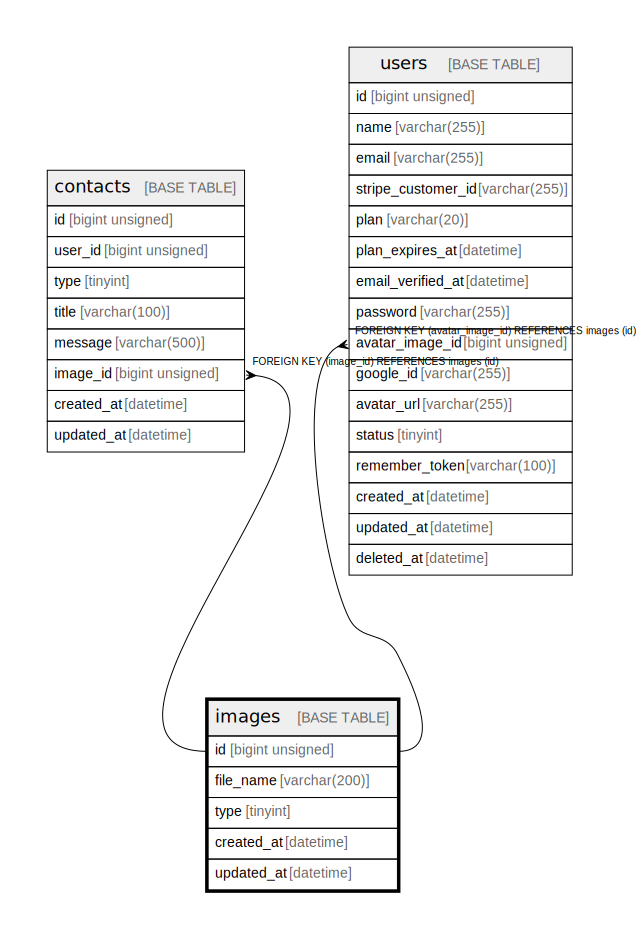

# images

## Description

画像

<details>
<summary><strong>Table Definition</strong></summary>

```sql
CREATE TABLE `images` (
  `id` bigint unsigned NOT NULL AUTO_INCREMENT,
  `file_name` varchar(200) COLLATE utf8mb4_unicode_ci NOT NULL COMMENT 'ファイル名',
  `type` tinyint NOT NULL COMMENT '画像タイプ',
  `created_at` datetime NOT NULL,
  `updated_at` datetime NOT NULL,
  PRIMARY KEY (`id`)
) ENGINE=InnoDB AUTO_INCREMENT=[Redacted by tbls] DEFAULT CHARSET=utf8mb4 COLLATE=utf8mb4_unicode_ci COMMENT='画像'
```

</details>

## Columns

| Name | Type | Default | Nullable | Extra Definition | Children | Parents | Comment |
| ---- | ---- | ------- | -------- | ---------------- | -------- | ------- | ------- |
| id | bigint unsigned |  | false | auto_increment | [contacts](contacts.md) [users](users.md) |  |  |
| file_name | varchar(200) |  | false |  |  |  | ファイル名 |
| type | tinyint |  | false |  |  |  | 画像タイプ |
| created_at | datetime |  | false |  |  |  |  |
| updated_at | datetime |  | false |  |  |  |  |

## Constraints

| Name | Type | Definition |
| ---- | ---- | ---------- |
| PRIMARY | PRIMARY KEY | PRIMARY KEY (id) |

## Indexes

| Name | Definition |
| ---- | ---------- |
| PRIMARY | PRIMARY KEY (id) USING BTREE |

## Relations



---

> Generated by [tbls](https://github.com/k1LoW/tbls)
