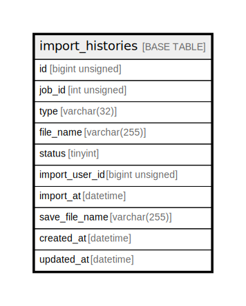

# import_histories

## Description

<details>
<summary><strong>Table Definition</strong></summary>

```sql
CREATE TABLE `import_histories` (
  `id` bigint unsigned NOT NULL AUTO_INCREMENT,
  `job_id` int unsigned DEFAULT NULL COMMENT 'ジョブ管理テーブル（jobs）ID',
  `type` varchar(32) COLLATE utf8mb4_unicode_ci NOT NULL COMMENT 'ジョブの種類',
  `file_name` varchar(255) COLLATE utf8mb4_unicode_ci NOT NULL COMMENT 'インポートファイル名',
  `status` tinyint NOT NULL DEFAULT '0' COMMENT 'ステータス',
  `import_user_id` bigint unsigned DEFAULT NULL COMMENT 'インポートしたユーザーID',
  `import_at` datetime DEFAULT NULL COMMENT 'インポートした日時',
  `save_file_name` varchar(255) COLLATE utf8mb4_unicode_ci NOT NULL COMMENT 'サーバ上に格納されたファイル名',
  `created_at` datetime NOT NULL,
  `updated_at` datetime NOT NULL,
  PRIMARY KEY (`id`),
  KEY `import_histories_type_index` (`type`)
) ENGINE=InnoDB DEFAULT CHARSET=utf8mb4 COLLATE=utf8mb4_unicode_ci
```

</details>

## Columns

| Name | Type | Default | Nullable | Extra Definition | Children | Parents | Comment |
| ---- | ---- | ------- | -------- | ---------------- | -------- | ------- | ------- |
| id | bigint unsigned |  | false | auto_increment |  |  |  |
| job_id | int unsigned |  | true |  |  |  | ジョブ管理テーブル（jobs）ID |
| type | varchar(32) |  | false |  |  |  | ジョブの種類 |
| file_name | varchar(255) |  | false |  |  |  | インポートファイル名 |
| status | tinyint | 0 | false |  |  |  | ステータス |
| import_user_id | bigint unsigned |  | true |  |  |  | インポートしたユーザーID |
| import_at | datetime |  | true |  |  |  | インポートした日時 |
| save_file_name | varchar(255) |  | false |  |  |  | サーバ上に格納されたファイル名 |
| created_at | datetime |  | false |  |  |  |  |
| updated_at | datetime |  | false |  |  |  |  |

## Constraints

| Name | Type | Definition |
| ---- | ---- | ---------- |
| PRIMARY | PRIMARY KEY | PRIMARY KEY (id) |

## Indexes

| Name | Definition |
| ---- | ---------- |
| import_histories_type_index | KEY import_histories_type_index (type) USING BTREE |
| PRIMARY | PRIMARY KEY (id) USING BTREE |

## Relations



---

> Generated by [tbls](https://github.com/k1LoW/tbls)
