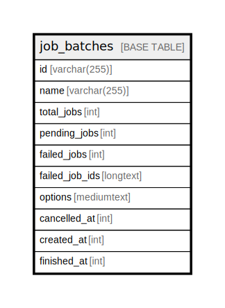

# job_batches

## Description

<details>
<summary><strong>Table Definition</strong></summary>

```sql
CREATE TABLE `job_batches` (
  `id` varchar(255) COLLATE utf8mb4_unicode_ci NOT NULL,
  `name` varchar(255) COLLATE utf8mb4_unicode_ci NOT NULL,
  `total_jobs` int NOT NULL,
  `pending_jobs` int NOT NULL,
  `failed_jobs` int NOT NULL,
  `failed_job_ids` longtext COLLATE utf8mb4_unicode_ci NOT NULL,
  `options` mediumtext COLLATE utf8mb4_unicode_ci,
  `cancelled_at` int DEFAULT NULL,
  `created_at` int NOT NULL,
  `finished_at` int DEFAULT NULL,
  PRIMARY KEY (`id`)
) ENGINE=InnoDB DEFAULT CHARSET=utf8mb4 COLLATE=utf8mb4_unicode_ci
```

</details>

## Columns

| Name | Type | Default | Nullable | Children | Parents | Comment |
| ---- | ---- | ------- | -------- | -------- | ------- | ------- |
| id | varchar(255) |  | false |  |  |  |
| name | varchar(255) |  | false |  |  |  |
| total_jobs | int |  | false |  |  |  |
| pending_jobs | int |  | false |  |  |  |
| failed_jobs | int |  | false |  |  |  |
| failed_job_ids | longtext |  | false |  |  |  |
| options | mediumtext |  | true |  |  |  |
| cancelled_at | int |  | true |  |  |  |
| created_at | int |  | false |  |  |  |
| finished_at | int |  | true |  |  |  |

## Constraints

| Name | Type | Definition |
| ---- | ---- | ---------- |
| PRIMARY | PRIMARY KEY | PRIMARY KEY (id) |

## Indexes

| Name | Definition |
| ---- | ---------- |
| PRIMARY | PRIMARY KEY (id) USING BTREE |

## Relations



---

> Generated by [tbls](https://github.com/k1LoW/tbls)
