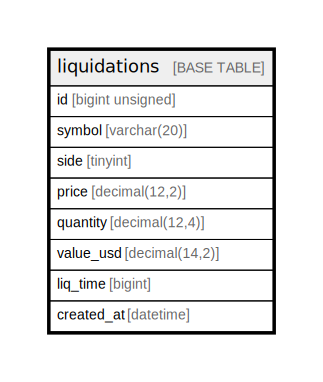

# liquidations

## Description

清算データ

<details>
<summary><strong>Table Definition</strong></summary>

```sql
CREATE TABLE `liquidations` (
  `id` bigint unsigned NOT NULL AUTO_INCREMENT COMMENT '清算データID',
  `symbol` varchar(20) COLLATE utf8mb4_unicode_ci NOT NULL COMMENT 'シンボル',
  `side` tinyint NOT NULL COMMENT '売買区分',
  `price` decimal(12,2) NOT NULL COMMENT '平均執行価格',
  `quantity` decimal(12,4) NOT NULL COMMENT '清算数量',
  `value_usd` decimal(14,2) NOT NULL COMMENT '清算額',
  `liq_time` bigint NOT NULL COMMENT '清算発生時刻',
  `created_at` datetime NOT NULL COMMENT '作成日時',
  PRIMARY KEY (`id`),
  KEY `idx_symbol_liq_time` (`symbol`,`liq_time`)
) ENGINE=InnoDB AUTO_INCREMENT=[Redacted by tbls] DEFAULT CHARSET=utf8mb4 COLLATE=utf8mb4_unicode_ci COMMENT='清算データ'
```

</details>

## Columns

| Name | Type | Default | Nullable | Extra Definition | Children | Parents | Comment |
| ---- | ---- | ------- | -------- | ---------------- | -------- | ------- | ------- |
| id | bigint unsigned |  | false | auto_increment |  |  | 清算データID |
| symbol | varchar(20) |  | false |  |  |  | シンボル |
| side | tinyint |  | false |  |  |  | 売買区分 |
| price | decimal(12,2) |  | false |  |  |  | 平均執行価格 |
| quantity | decimal(12,4) |  | false |  |  |  | 清算数量 |
| value_usd | decimal(14,2) |  | false |  |  |  | 清算額 |
| liq_time | bigint |  | false |  |  |  | 清算発生時刻 |
| created_at | datetime |  | false |  |  |  | 作成日時 |

## Constraints

| Name | Type | Definition |
| ---- | ---- | ---------- |
| PRIMARY | PRIMARY KEY | PRIMARY KEY (id) |

## Indexes

| Name | Definition |
| ---- | ---------- |
| idx_symbol_liq_time | KEY idx_symbol_liq_time (symbol, liq_time) USING BTREE |
| PRIMARY | PRIMARY KEY (id) USING BTREE |

## Relations



---

> Generated by [tbls](https://github.com/k1LoW/tbls)
