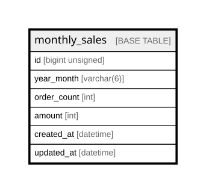

# monthly_sales

## Description

月別売上

<details>
<summary><strong>Table Definition</strong></summary>

```sql
CREATE TABLE `monthly_sales` (
  `id` bigint unsigned NOT NULL AUTO_INCREMENT,
  `year_month` varchar(6) COLLATE utf8mb4_unicode_ci NOT NULL COMMENT '年月',
  `order_count` int NOT NULL DEFAULT '0' COMMENT '注文数',
  `amount` int NOT NULL DEFAULT '0' COMMENT '売上金額',
  `created_at` datetime NOT NULL,
  `updated_at` datetime NOT NULL,
  PRIMARY KEY (`id`)
) ENGINE=InnoDB AUTO_INCREMENT=[Redacted by tbls] DEFAULT CHARSET=utf8mb4 COLLATE=utf8mb4_unicode_ci COMMENT='月別売上'
```

</details>

## Columns

| Name | Type | Default | Nullable | Extra Definition | Children | Parents | Comment |
| ---- | ---- | ------- | -------- | ---------------- | -------- | ------- | ------- |
| id | bigint unsigned |  | false | auto_increment |  |  |  |
| year_month | varchar(6) |  | false |  |  |  | 年月 |
| order_count | int | 0 | false |  |  |  | 注文数 |
| amount | int | 0 | false |  |  |  | 売上金額 |
| created_at | datetime |  | false |  |  |  |  |
| updated_at | datetime |  | false |  |  |  |  |

## Constraints

| Name | Type | Definition |
| ---- | ---- | ---------- |
| PRIMARY | PRIMARY KEY | PRIMARY KEY (id) |

## Indexes

| Name | Definition |
| ---- | ---------- |
| PRIMARY | PRIMARY KEY (id) USING BTREE |

## Relations



---

> Generated by [tbls](https://github.com/k1LoW/tbls)
