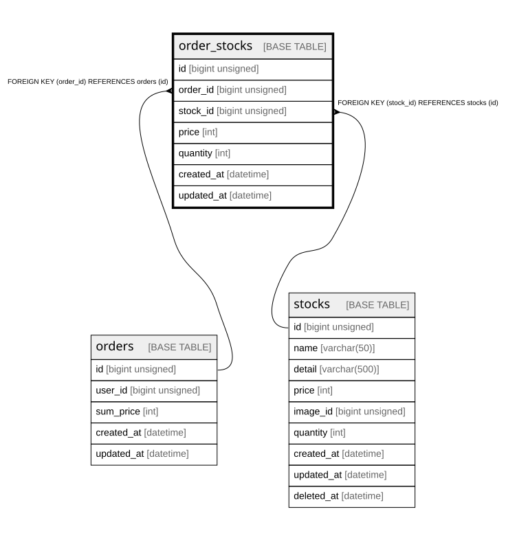

# order_stocks

## Description

注文商品

<details>
<summary><strong>Table Definition</strong></summary>

```sql
CREATE TABLE `order_stocks` (
  `id` bigint unsigned NOT NULL AUTO_INCREMENT,
  `order_id` bigint unsigned NOT NULL,
  `stock_id` bigint unsigned NOT NULL,
  `price` int NOT NULL DEFAULT '0' COMMENT '価格',
  `quantity` int NOT NULL DEFAULT '0' COMMENT '個数',
  `created_at` datetime NOT NULL,
  `updated_at` datetime NOT NULL,
  PRIMARY KEY (`id`),
  KEY `order_stocks_order_id_foreign` (`order_id`),
  KEY `order_stocks_stock_id_foreign` (`stock_id`),
  CONSTRAINT `order_stocks_order_id_foreign` FOREIGN KEY (`order_id`) REFERENCES `orders` (`id`),
  CONSTRAINT `order_stocks_stock_id_foreign` FOREIGN KEY (`stock_id`) REFERENCES `stocks` (`id`)
) ENGINE=InnoDB AUTO_INCREMENT=[Redacted by tbls] DEFAULT CHARSET=utf8mb4 COLLATE=utf8mb4_unicode_ci COMMENT='注文商品'
```

</details>

## Columns

| Name | Type | Default | Nullable | Extra Definition | Children | Parents | Comment |
| ---- | ---- | ------- | -------- | ---------------- | -------- | ------- | ------- |
| id | bigint unsigned |  | false | auto_increment |  |  |  |
| order_id | bigint unsigned |  | false |  |  | [orders](orders.md) |  |
| stock_id | bigint unsigned |  | false |  |  | [stocks](stocks.md) |  |
| price | int | 0 | false |  |  |  | 価格 |
| quantity | int | 0 | false |  |  |  | 個数 |
| created_at | datetime |  | false |  |  |  |  |
| updated_at | datetime |  | false |  |  |  |  |

## Constraints

| Name | Type | Definition |
| ---- | ---- | ---------- |
| order_stocks_order_id_foreign | FOREIGN KEY | FOREIGN KEY (order_id) REFERENCES orders (id) |
| order_stocks_stock_id_foreign | FOREIGN KEY | FOREIGN KEY (stock_id) REFERENCES stocks (id) |
| PRIMARY | PRIMARY KEY | PRIMARY KEY (id) |

## Indexes

| Name | Definition |
| ---- | ---------- |
| order_stocks_order_id_foreign | KEY order_stocks_order_id_foreign (order_id) USING BTREE |
| order_stocks_stock_id_foreign | KEY order_stocks_stock_id_foreign (stock_id) USING BTREE |
| PRIMARY | PRIMARY KEY (id) USING BTREE |

## Relations



---

> Generated by [tbls](https://github.com/k1LoW/tbls)
