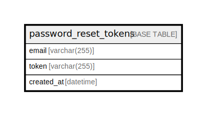

# password_reset_tokens

## Description

<details>
<summary><strong>Table Definition</strong></summary>

```sql
CREATE TABLE `password_reset_tokens` (
  `email` varchar(255) COLLATE utf8mb4_unicode_ci NOT NULL,
  `token` varchar(255) COLLATE utf8mb4_unicode_ci NOT NULL,
  `created_at` datetime NOT NULL,
  PRIMARY KEY (`email`)
) ENGINE=InnoDB DEFAULT CHARSET=utf8mb4 COLLATE=utf8mb4_unicode_ci
```

</details>

## Columns

| Name | Type | Default | Nullable | Children | Parents | Comment |
| ---- | ---- | ------- | -------- | -------- | ------- | ------- |
| email | varchar(255) |  | false |  |  |  |
| token | varchar(255) |  | false |  |  |  |
| created_at | datetime |  | false |  |  |  |

## Constraints

| Name | Type | Definition |
| ---- | ---- | ---------- |
| PRIMARY | PRIMARY KEY | PRIMARY KEY (email) |

## Indexes

| Name | Definition |
| ---- | ---------- |
| PRIMARY | PRIMARY KEY (email) USING BTREE |

## Relations



---

> Generated by [tbls](https://github.com/k1LoW/tbls)
