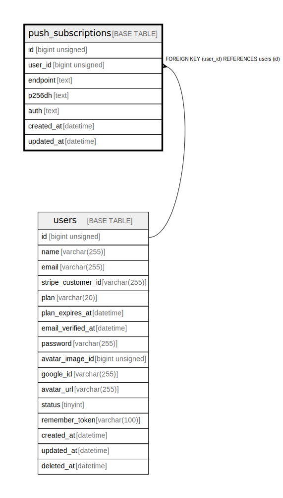

# push_subscriptions

## Description

ブラウザプッシュ通知購読

<details>
<summary><strong>Table Definition</strong></summary>

```sql
CREATE TABLE `push_subscriptions` (
  `id` bigint unsigned NOT NULL AUTO_INCREMENT COMMENT 'プッシュ通知購読ID',
  `user_id` bigint unsigned NOT NULL COMMENT 'ユーザーID',
  `endpoint` text COLLATE utf8mb4_unicode_ci NOT NULL COMMENT 'エンドポイント',
  `p256dh` text COLLATE utf8mb4_unicode_ci NOT NULL COMMENT 'p256dhキー',
  `auth` text COLLATE utf8mb4_unicode_ci NOT NULL COMMENT '認証キー',
  `created_at` datetime NOT NULL COMMENT '作成日時',
  `updated_at` datetime NOT NULL COMMENT '更新日時',
  PRIMARY KEY (`id`),
  KEY `idx_user_id` (`user_id`),
  CONSTRAINT `push_subscriptions_user_id_foreign` FOREIGN KEY (`user_id`) REFERENCES `users` (`id`) ON DELETE CASCADE
) ENGINE=InnoDB DEFAULT CHARSET=utf8mb4 COLLATE=utf8mb4_unicode_ci COMMENT='ブラウザプッシュ通知購読'
```

</details>

## Columns

| Name | Type | Default | Nullable | Extra Definition | Children | Parents | Comment |
| ---- | ---- | ------- | -------- | ---------------- | -------- | ------- | ------- |
| id | bigint unsigned |  | false | auto_increment |  |  | プッシュ通知購読ID |
| user_id | bigint unsigned |  | false |  |  | [users](users.md) | ユーザーID |
| endpoint | text |  | false |  |  |  | エンドポイント |
| p256dh | text |  | false |  |  |  | p256dhキー |
| auth | text |  | false |  |  |  | 認証キー |
| created_at | datetime |  | false |  |  |  | 作成日時 |
| updated_at | datetime |  | false |  |  |  | 更新日時 |

## Constraints

| Name | Type | Definition |
| ---- | ---- | ---------- |
| PRIMARY | PRIMARY KEY | PRIMARY KEY (id) |
| push_subscriptions_user_id_foreign | FOREIGN KEY | FOREIGN KEY (user_id) REFERENCES users (id) |

## Indexes

| Name | Definition |
| ---- | ---------- |
| idx_user_id | KEY idx_user_id (user_id) USING BTREE |
| PRIMARY | PRIMARY KEY (id) USING BTREE |

## Relations



---

> Generated by [tbls](https://github.com/k1LoW/tbls)
