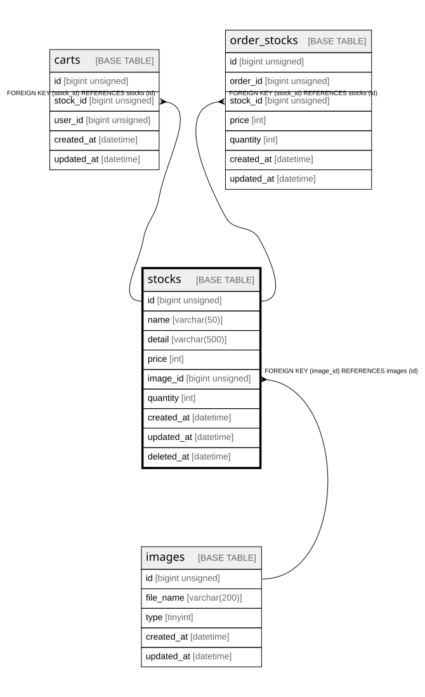

# stocks

## Description

商品

<details>
<summary><strong>Table Definition</strong></summary>

```sql
CREATE TABLE `stocks` (
  `id` bigint unsigned NOT NULL AUTO_INCREMENT,
  `name` varchar(50) COLLATE utf8mb4_unicode_ci NOT NULL COMMENT '商品名',
  `detail` varchar(500) COLLATE utf8mb4_unicode_ci NOT NULL COMMENT '説明文',
  `price` int NOT NULL DEFAULT '0' COMMENT '価格',
  `image_id` bigint unsigned DEFAULT NULL,
  `quantity` int NOT NULL DEFAULT '0' COMMENT '在庫数',
  `created_at` datetime NOT NULL,
  `updated_at` datetime NOT NULL,
  `deleted_at` datetime DEFAULT NULL,
  PRIMARY KEY (`id`),
  KEY `stocks_image_id_foreign` (`image_id`),
  CONSTRAINT `stocks_image_id_foreign` FOREIGN KEY (`image_id`) REFERENCES `images` (`id`)
) ENGINE=InnoDB AUTO_INCREMENT=[Redacted by tbls] DEFAULT CHARSET=utf8mb4 COLLATE=utf8mb4_unicode_ci COMMENT='商品'
```

</details>

## Columns

| Name | Type | Default | Nullable | Extra Definition | Children | Parents | Comment |
| ---- | ---- | ------- | -------- | ---------------- | -------- | ------- | ------- |
| id | bigint unsigned |  | false | auto_increment | [carts](carts.md) [order_stocks](order_stocks.md) |  |  |
| name | varchar(50) |  | false |  |  |  | 商品名 |
| detail | varchar(500) |  | false |  |  |  | 説明文 |
| price | int | 0 | false |  |  |  | 価格 |
| image_id | bigint unsigned |  | true |  |  | [images](images.md) |  |
| quantity | int | 0 | false |  |  |  | 在庫数 |
| created_at | datetime |  | false |  |  |  |  |
| updated_at | datetime |  | false |  |  |  |  |
| deleted_at | datetime |  | true |  |  |  |  |

## Constraints

| Name | Type | Definition |
| ---- | ---- | ---------- |
| PRIMARY | PRIMARY KEY | PRIMARY KEY (id) |
| stocks_image_id_foreign | FOREIGN KEY | FOREIGN KEY (image_id) REFERENCES images (id) |

## Indexes

| Name | Definition |
| ---- | ---------- |
| stocks_image_id_foreign | KEY stocks_image_id_foreign (image_id) USING BTREE |
| PRIMARY | PRIMARY KEY (id) USING BTREE |

## Relations



---

> Generated by [tbls](https://github.com/k1LoW/tbls)
