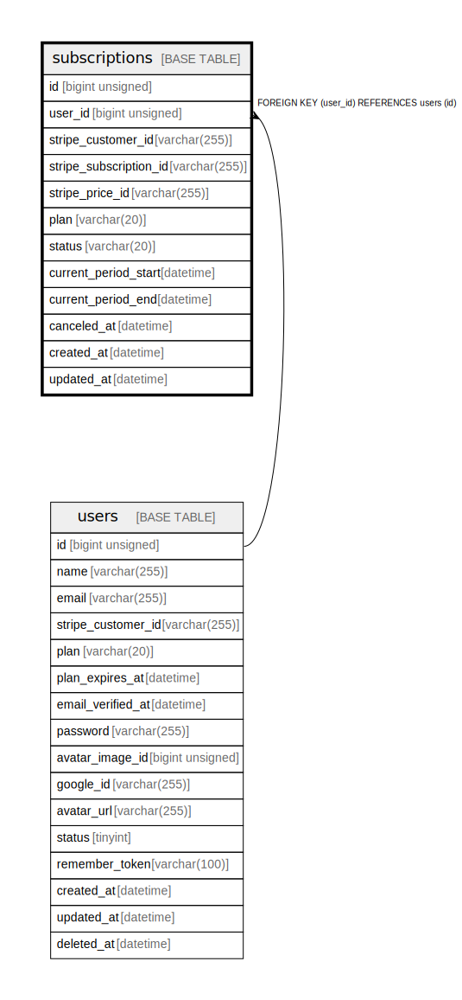

# subscriptions

## Description

サブスクリプション

<details>
<summary><strong>Table Definition</strong></summary>

```sql
CREATE TABLE `subscriptions` (
  `id` bigint unsigned NOT NULL AUTO_INCREMENT COMMENT 'サブスクリプションID',
  `user_id` bigint unsigned NOT NULL COMMENT 'ユーザーID',
  `stripe_customer_id` varchar(255) COLLATE utf8mb4_unicode_ci NOT NULL COMMENT 'Stripe顧客ID',
  `stripe_subscription_id` varchar(255) COLLATE utf8mb4_unicode_ci DEFAULT NULL COMMENT 'StripeサブスクリプションID',
  `stripe_price_id` varchar(255) COLLATE utf8mb4_unicode_ci DEFAULT NULL COMMENT 'Stripe価格ID',
  `plan` varchar(20) COLLATE utf8mb4_unicode_ci NOT NULL DEFAULT 'free' COMMENT 'プラン',
  `status` varchar(20) COLLATE utf8mb4_unicode_ci NOT NULL DEFAULT 'active' COMMENT 'ステータス',
  `current_period_start` datetime DEFAULT NULL COMMENT '課金期間開始日時',
  `current_period_end` datetime DEFAULT NULL COMMENT '課金期間終了日時',
  `canceled_at` datetime DEFAULT NULL COMMENT '解約日時',
  `created_at` datetime NOT NULL COMMENT '作成日時',
  `updated_at` datetime NOT NULL COMMENT '更新日時',
  PRIMARY KEY (`id`),
  UNIQUE KEY `uq_user_id` (`user_id`),
  KEY `idx_stripe_subscription_id` (`stripe_subscription_id`),
  CONSTRAINT `subscriptions_user_id_foreign` FOREIGN KEY (`user_id`) REFERENCES `users` (`id`) ON DELETE CASCADE
) ENGINE=InnoDB AUTO_INCREMENT=[Redacted by tbls] DEFAULT CHARSET=utf8mb4 COLLATE=utf8mb4_unicode_ci COMMENT='サブスクリプション'
```

</details>

## Columns

| Name | Type | Default | Nullable | Extra Definition | Children | Parents | Comment |
| ---- | ---- | ------- | -------- | ---------------- | -------- | ------- | ------- |
| id | bigint unsigned |  | false | auto_increment |  |  | サブスクリプションID |
| user_id | bigint unsigned |  | false |  |  | [users](users.md) | ユーザーID |
| stripe_customer_id | varchar(255) |  | false |  |  |  | Stripe顧客ID |
| stripe_subscription_id | varchar(255) |  | true |  |  |  | StripeサブスクリプションID |
| stripe_price_id | varchar(255) |  | true |  |  |  | Stripe価格ID |
| plan | varchar(20) | free | false |  |  |  | プラン |
| status | varchar(20) | active | false |  |  |  | ステータス |
| current_period_start | datetime |  | true |  |  |  | 課金期間開始日時 |
| current_period_end | datetime |  | true |  |  |  | 課金期間終了日時 |
| canceled_at | datetime |  | true |  |  |  | 解約日時 |
| created_at | datetime |  | false |  |  |  | 作成日時 |
| updated_at | datetime |  | false |  |  |  | 更新日時 |

## Constraints

| Name | Type | Definition |
| ---- | ---- | ---------- |
| PRIMARY | PRIMARY KEY | PRIMARY KEY (id) |
| subscriptions_user_id_foreign | FOREIGN KEY | FOREIGN KEY (user_id) REFERENCES users (id) |
| uq_user_id | UNIQUE | UNIQUE KEY uq_user_id (user_id) |

## Indexes

| Name | Definition |
| ---- | ---------- |
| idx_stripe_subscription_id | KEY idx_stripe_subscription_id (stripe_subscription_id) USING BTREE |
| PRIMARY | PRIMARY KEY (id) USING BTREE |
| uq_user_id | UNIQUE KEY uq_user_id (user_id) USING BTREE |

## Relations



---

> Generated by [tbls](https://github.com/k1LoW/tbls)
