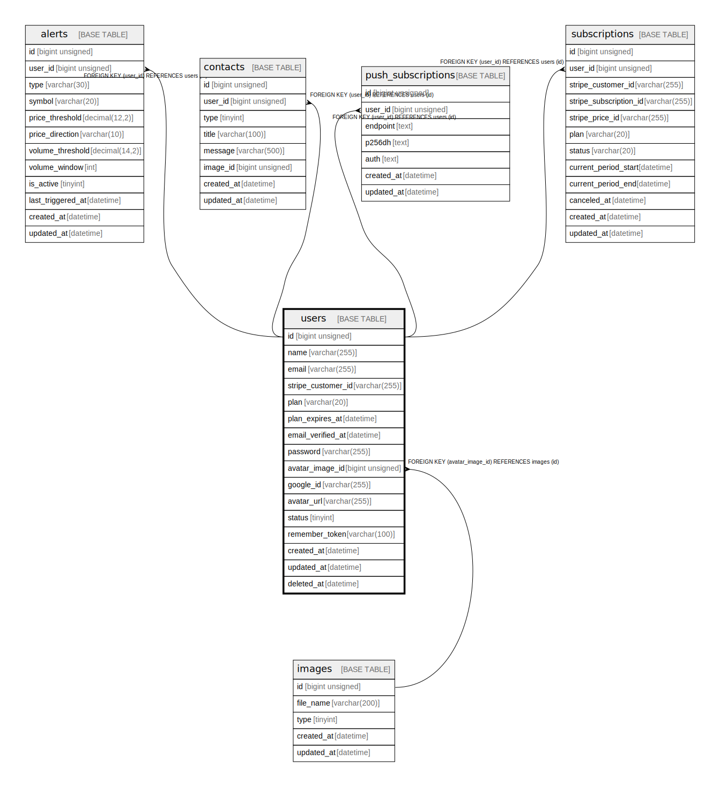

# users

## Description

<details>
<summary><strong>Table Definition</strong></summary>

```sql
CREATE TABLE `users` (
  `id` bigint unsigned NOT NULL AUTO_INCREMENT,
  `name` varchar(255) COLLATE utf8mb4_unicode_ci NOT NULL COMMENT '表示名',
  `email` varchar(255) COLLATE utf8mb4_unicode_ci NOT NULL COMMENT 'メールアドレス',
  `stripe_customer_id` varchar(255) COLLATE utf8mb4_unicode_ci DEFAULT NULL COMMENT 'Stripe顧客ID',
  `plan` varchar(20) COLLATE utf8mb4_unicode_ci NOT NULL DEFAULT 'free' COMMENT 'プラン',
  `plan_expires_at` datetime DEFAULT NULL COMMENT 'プラン有効期限',
  `email_verified_at` datetime DEFAULT NULL COMMENT 'メールアドレス確認日時',
  `password` varchar(255) COLLATE utf8mb4_unicode_ci DEFAULT NULL COMMENT 'パスワード',
  `avatar_image_id` bigint unsigned DEFAULT NULL,
  `google_id` varchar(255) COLLATE utf8mb4_unicode_ci DEFAULT NULL COMMENT 'GoogleアカウントID(OAuthログイン専用)',
  `avatar_url` varchar(255) COLLATE utf8mb4_unicode_ci DEFAULT NULL COMMENT 'アバターURL(OAuthログイン専用)',
  `status` tinyint NOT NULL DEFAULT '0' COMMENT 'ステータス',
  `remember_token` varchar(100) COLLATE utf8mb4_unicode_ci DEFAULT NULL,
  `created_at` datetime NOT NULL,
  `updated_at` datetime NOT NULL,
  `deleted_at` datetime DEFAULT NULL,
  PRIMARY KEY (`id`),
  UNIQUE KEY `users_email_unique` (`email`),
  UNIQUE KEY `users_google_id_unique` (`google_id`),
  KEY `users_avatar_image_id_foreign` (`avatar_image_id`),
  CONSTRAINT `users_avatar_image_id_foreign` FOREIGN KEY (`avatar_image_id`) REFERENCES `images` (`id`)
) ENGINE=InnoDB AUTO_INCREMENT=[Redacted by tbls] DEFAULT CHARSET=utf8mb4 COLLATE=utf8mb4_unicode_ci
```

</details>

## Columns

| Name | Type | Default | Nullable | Extra Definition | Children | Parents | Comment |
| ---- | ---- | ------- | -------- | ---------------- | -------- | ------- | ------- |
| id | bigint unsigned |  | false | auto_increment | [alerts](alerts.md) [contacts](contacts.md) [push_subscriptions](push_subscriptions.md) [subscriptions](subscriptions.md) |  |  |
| name | varchar(255) |  | false |  |  |  | 表示名 |
| email | varchar(255) |  | false |  |  |  | メールアドレス |
| stripe_customer_id | varchar(255) |  | true |  |  |  | Stripe顧客ID |
| plan | varchar(20) | free | false |  |  |  | プラン |
| plan_expires_at | datetime |  | true |  |  |  | プラン有効期限 |
| email_verified_at | datetime |  | true |  |  |  | メールアドレス確認日時 |
| password | varchar(255) |  | true |  |  |  | パスワード |
| avatar_image_id | bigint unsigned |  | true |  |  | [images](images.md) |  |
| google_id | varchar(255) |  | true |  |  |  | GoogleアカウントID(OAuthログイン専用) |
| avatar_url | varchar(255) |  | true |  |  |  | アバターURL(OAuthログイン専用) |
| status | tinyint | 0 | false |  |  |  | ステータス |
| remember_token | varchar(100) |  | true |  |  |  |  |
| created_at | datetime |  | false |  |  |  |  |
| updated_at | datetime |  | false |  |  |  |  |
| deleted_at | datetime |  | true |  |  |  |  |

## Constraints

| Name | Type | Definition |
| ---- | ---- | ---------- |
| PRIMARY | PRIMARY KEY | PRIMARY KEY (id) |
| users_avatar_image_id_foreign | FOREIGN KEY | FOREIGN KEY (avatar_image_id) REFERENCES images (id) |
| users_email_unique | UNIQUE | UNIQUE KEY users_email_unique (email) |
| users_google_id_unique | UNIQUE | UNIQUE KEY users_google_id_unique (google_id) |

## Indexes

| Name | Definition |
| ---- | ---------- |
| users_avatar_image_id_foreign | KEY users_avatar_image_id_foreign (avatar_image_id) USING BTREE |
| PRIMARY | PRIMARY KEY (id) USING BTREE |
| users_email_unique | UNIQUE KEY users_email_unique (email) USING BTREE |
| users_google_id_unique | UNIQUE KEY users_google_id_unique (google_id) USING BTREE |

## Relations



---

> Generated by [tbls](https://github.com/k1LoW/tbls)
