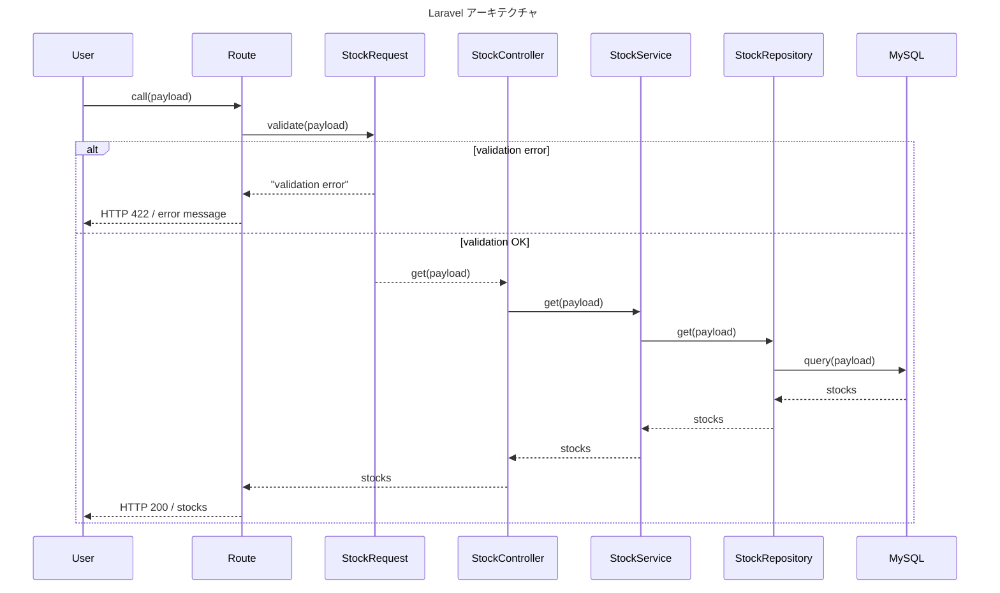

# Laravel コーディング規約

このプロジェクトでは、一貫性と可読性を高めるために、Laravelを使用したアプリケーションの開発において以下のコーディング規約に従います。

---

## 目次

- [基本方針](#基本方針)
- [命名規則](#命名規則)
- [コーディングスタイル](#コーディングスタイル)
- [アーキテクチャ](#アーキテクチャ)
- [コントローラ](#コントローラ)
- [サービス](#サービス)
- [リポジトリ](#リポジトリ)
- [エンティティ](#エンティティ)
- [DTO](#dto)
- [Enum](#enum)
- [フォームリクエスト](#フォームリクエスト)
- [マイグレーション](#マイグレーション)
- [ルーティング](#ルーティング)
- [Blade テンプレート](#blade-テンプレート)
- [テストコード](#テストコード)
- [使用ツール](#使用ツール)

---

## 基本方針

- [PSR-1](https://www.php-fig.org/psr/psr-1/) および [PSR-12](https://www.php-fig.org/psr/psr-12/) に準拠します。
- PHP タグは `<?php` を使用し、閉じタグは記述しません。
- プロジェクト独自のドメイン分割ディレクトリ構成を採用します（`app/Domain/`、`app/Services/`、`app/Dto/`、`app/Enums/` 等）。

---

## 命名規則

- クラス名は、`UpperCamelCase` で記載します。
- 変数名・メソッド名・プロパティ名は、`lowerCamelCase` で記載します。
- ただし、Eloquentモデルのカラム名はデータベースのカラム名に対応するため `lower_snake_case` を使用します。
- 定数は、`UPPER_SNAKE_CASE` で記載します。

---

## コーディングスタイル

- インデントは スペース4つとし、タブは使用しません。
- 厳密な比較を行う（`==`, `!=` などの曖昧な比較を使わない）
- 制御構文では、1行でも必ずブロック `{}` を使用します（省略禁止）。
- `else if` ではなく `elseif` を使用する（スペースで空けない）。
- クラスやメソッドの `{}` は改行で独立させます。（但し、引数に改行が含まれる場合は一行で書く）
- 三項演算子のネストは禁止
- ヨーダ記法（比較の際にチェック値を左に置く）
- 複数行配列の最後にカンマを置く
- 配列内は改行させる
- タイプヒント、リターンヒントで型定義を行い、難しい場合はphpDocを代用する。

---

## アーキテクチャ



---

## コントローラ

- コントローラはできるだけ薄く保ち、処理はサービスクラスに委譲します。
- Laravel のリソースコントローラ構成（index, show, store など）に準拠します。
- ルートモデルバインディングを活用します。
- トランザクションはコントローラクラス内で実装します。
- 1つのアクションにつき、1つのサービスクラスを作成します。
- サービスクラスのインスタンス生成には app() を使用します。

```php
/**
 * 商品登録処理
 */
public function store(StoreRequest $request): RedirectResponse
{
    $dto = new CreateDto($request);

    /** @var CreateService $service */
    $service = app(CreateService::class);

    DB::beginTransaction();
    try {
        $stock = $service->save($dto);
        DB::commit();
    } catch (Throwable $e) {
        DB::rollBack();
        throw $e;
    }
    return redirect(route('admin.stock.show', $stock));
}
```

---

## サービス

- ビジネスロジックの記述に集中します。
- DB へのアクセスは Eloquent を直接使用せず、リポジトリを介します。
- リポジトリの注入には、コンストラクタインジェクションを使用します。
- リポジトリはインターフェース型で注入します。
- すべてのサービスクラスは `BaseService` を継承します。

```php
<?php

namespace App\Services\Admin\Stock;

use App\Domain\Repositories\Stock\StockRepositoryInterface;
use App\Dto\Request\Admin\Stock\CreateDto;
use App\Services\BaseService;

class CreateService extends BaseService
{
    protected StockRepositoryInterface $stockRepository;

    public function __construct(StockRepositoryInterface $stockRepository)
    {
        $this->stockRepository = $stockRepository;
    }

    /**
     * 商品を登録します。
     */
    public function save(CreateDto $dto): Stock
    {
        return $this->stockRepository->create([
            'name'     => $dto->name,
            'detail'   => $dto->detail,
            'price'    => $dto->price,
            'quantity' => $dto->quantity,
        ]);
    }
}
```

---

## リポジトリ

- リポジトリは `app/Domain/Repositories` に配置します。
- 各リポジトリはインターフェース（`XxxRepositoryInterface`）と実装クラス（`XxxRepository`）の2ファイルで構成します。
- `XxxRepositoryInterface` は `BaseRepositoryInterface` を継承し、固有のメソッドを定義します。
- `XxxRepository` は `BaseRepository` を継承し、`XxxRepositoryInterface` を実装します。
- `create`、`update`、`delete`、`getAll`、`findById` などは BaseRepository を継承して実装します。
- 1メソッドで使用する SQL は原則1クエリとし、シンプルな構成にします。
- 関数名は、単一レコードを返す場合は findXXX、複数の場合は getXXX とします。
- すべての関数に、引数と戻り値の型定義を明記します。

```php
// インターフェース
interface StockRepositoryInterface extends BaseRepositoryInterface
{
    public function getByLimit(int $limit = 0): LengthAwarePaginator;

    /**
     * @param array{
     *   name: ?string,
     *   sort_name: ?string,
     *   sort_direction: 'asc'|'desc'|null,
     *   limit?: ?int,
     * } $conditions
     */
    public function getByConditions(array $conditions): Collection|LengthAwarePaginator;
}

// 実装クラス
class StockRepository extends BaseRepository implements StockRepositoryInterface
{
    protected function model(): string
    {
        return Stock::class;
    }

    /**
     * {@inheritDoc}
     */
    public function getByLimit(int $limit = 0): LengthAwarePaginator
    {
        /** @var LengthAwarePaginator<int, Stock> */
        return $this->model
            ->orderBy('id', 'desc')
            ->paginate($limit);
    }
}
```

---

## エンティティ

- エンティティは `app/Domain/Entities` に配置します。
- リレーションは `hasOne` 及び `belongsTo` のみとし、`hasMany` はリポジトリの責務を明確にするため極力避けます。
- 型定義は `@property` アノテーションで記述し、IDE 補完を効かせます。
- 日付型カラムは `$casts` に `datetime` を指定し、Carbon インスタンスとして扱います。

```php
/**
 * @property int $id
 * @property string|null $name
 * @property int|null $price
 * @property Carbon|null $created_at
 * @property Carbon|null $updated_at
 */
class Stock extends Model
{
    /** @phpstan-use HasFactory<StockFactory> */
    use HasFactory;

    protected $table = 'stocks';

    /**
     * The attributes that are mass assignable.
     *
     * @var list<string>
     */
    protected $fillable = [
        'name',
        'detail',
        'price',
    ];

    /**
     * The attributes that should be cast.
     *
     * @var array<string, string>
     */
    protected $casts = [
        'created_at' => 'datetime',
        'updated_at' => 'datetime',
    ];

    /**
     * @return BelongsTo<Office, $this>
     */
    public function office(): BelongsTo
    {
        return $this->belongsTo(Office::class);
    }
}
```

---

## DTO

- DTO（Data Transfer Object）は `app/Dto` に配置します。
- リクエスト系DTOは `app/Dto/Request/` に、レスポンス系は `app/Dto/Response/` に配置します。
- FormRequest を受け取り、コントローラとサービス間でのデータ受け渡しに使用します。
- プロパティ名は `lowerCamelCase` で記載します。

```php
<?php

namespace App\Dto\Request\Admin\Stock;

use App\Http\Requests\Admin\Stock\StoreRequest;

class CreateDto
{
    public ?string $name;
    public ?string $detail;
    public ?int $price;
    public ?int $quantity;
    public ?string $imageFileName;

    public function __construct(StoreRequest $request)
    {
        $this->name          = (string) $request->input('name');
        $this->detail        = (string) $request->input('detail');
        $this->price         = (int) $request->input('price');
        $this->quantity      = (int) $request->input('quantity');
        $this->imageFileName = (string) $request->input('image_file_name');
    }
}
```

---

## Enum

- Enum は `app/Enums` に配置します。
- バックドEenumを使用し、整数型（`int`）または文字列型（`string`）のいずれかを選択します。
- ラベル取得用の `label()` メソッドを定義します（翻訳ファイルと連携）。
- ビジネスロジックに関連する判定メソッド（`isXxx()`）をEnumに持たせます。

```php
<?php

namespace App\Enums;

enum UserStatus: int
{
    case Active = 0;
    case Suspended = 1;

    public function label(): string
    {
        return __('enums.UserStatus' . $this->value);
    }

    public function isActive(): bool
    {
        return $this === self::Active;
    }
}
```

---

## フォームリクエスト

- 入力チェックは可能な限り Request クラスに定義します。
- バリデーションルールは配列形式で記述します。
- `string` / `integer` など型を明示します。
- ルールの記述順は、型指定 → 条件 → DB 関連 の順とします。
- `nullable` と `required` を同時に使用しないようにします。

```php
class StoreRequest extends FormRequest
{
    /**
     * Get the validation rules that apply to the request.
     *
     * @return array<string>
     */
    public function rules(): array
    {
        return [
            'name' => [
                'required',
                'string',
            ],
            'price' => [
                'required',
                'integer',
                'min:1',
                'max:99999',
            ],
            'sale_limit_at' => [
                'nullable',
                'string',
                'date_format:Y/m/d',
                'after_or_equal:today',
            ],

        ];
    }

    /**
     * Add after hook to the validator.
     */
    public function withValidator(Validator $validator): void
    {
        /** @var Office $office */
        $office = $this->office;

        $validator->after(function ($validator) use($office) {
            if ($office->isSalesSuspended()) {
                $validator->errors()->add('office_id', '該当の事業所は、営業停止中の為、商品の登録ができません。');
            }
        });
    }

    /**
     * @return array<string>
     */
    public function attributes(): array
    {
        return [
            'name' => '商品名',
            'price' => '価格',
            'sale_limit_at' => 'セール終了日時',
        ];
    }

    /**
     * Get the error messages for the defined validation rules.
     *
     * @return array<string>
     */
    public function messages(): array
    {
        return [
            '*.after_or_equal' => ':attributeは、当日以降を指定してください。',
        ];
    }

}
```

---

## マイグレーション

- 命名規則：create_users_table、add_status_to_orders_table など。
- 各カラムには `comment()` を必ず記述します。
- `nullable()` や `default()` を積極的に活用し、意図を明示します。
- `master` 及び `develop` ブランチに反映後は修正せずに、別のマイグレーションファイルを追加します。
- テーブル名は複数形で命名する。

```php
return new class extends Migration
{
    /**
     * Run the migrations.
     *
     * @return void
     */
    public function up(): void
    {
        Schema::create('stocks', static function (Blueprint $table) {
            $table->bigIncrements('id')->comment('商品ID');
            $table->string('name', '100')->comment('商品名');
            $table->integer('price')->default(0)->comment('価格');
            $table->timestamps();
        });
        DB::statement("ALTER TABLE stocks COMMENT '商品'");
    }

    /**
     * Reverse the migrations.
     *
     * @return void
     */
    public function down(): void
    {
        Schema::dropIfExists('stocks');
    }
};
```

---

## ルーティング

- 保守性とルートの明示性を重視するため `resource()` は使用せず、すべてのルートを明示的に定義します。
- ネストしたルートは `Route::group()` を活用して整理します。
- 名前付きルートを利用し、users.index、orders.show など一貫性を保ちます。

```php
Route::prefix('admin')->group(function () {
    Route::get('stock', [\App\Http\Controllers\Admin\Stock\ListController::class, 'index'])->name('admin.stock');
    Route::get('stock/create', [\App\Http\Controllers\Admin\Stock\CreateController::class, 'create'])->name('admin.stock.create');
    Route::post('stock/store', [\App\Http\Controllers\Admin\Stock\CreateController::class, 'store'])->name('admin.stock.store');
    Route::get('stock/{stock}', [\App\Http\Controllers\Admin\Stock\DetailController::class, 'show'])->name('admin.stock.show');
});
```

---

## Blade テンプレート

- `@extends`、`@section`、`@yield` を使ってレイアウトを管理します。
- if 文などは簡易な表示制御として許容。ただしデータ加工・判断はサービスまたは ViewModel に移す。
- インデントはスペース4つを使用し、コードと統一します。

---

## テストコード

- テストファイル名は UserControllerTest.php、OrderServiceTest.php のように明確にします。
- Laravel のテストヘルパー（actingAs、assertDatabaseHas など）を積極的に活用します。
- テストメソッド名は、動作の内容がわかるように記述します。
- `Storage:fake()`、`Mail::fake()` などのFacadeを積極的に利用します。
- テスト共通のヘルパーメソッド（`createDefaultUser()`、`createDefaultAdmin()` など）は `BaseTest` クラスに定義します。

```php
public function test_store(): void
{
    Storage::fake('s3');

    $admin = $this->createDefaultAdmin([
        'role' => AdminRole::HighManager,
    ]);
    $this->actingAs($admin, 'admin');

    $response = $this->post(route('admin.stock.store'), [
        'name'     => 'テスト商品',
        'price'    => 1000,
        'quantity' => 10,
    ]);

    $response->assertRedirect();
    $this->assertDatabaseHas('stocks', ['name' => 'テスト商品']);
}

public function test_store_service_error(): void
{
    $this->mock(CreateService::class, function ($mock) {
        $mock->shouldReceive('save')->andThrow(new Exception('Service Error'));
    });

    $response = $this->post(route('admin.stock.store'), [...]);
    $response->assertStatus(500);
}
```

---

## 使用ツール

- 以下のツールを使用して、コードの品質を自動でチェック・整形します。
- PHPStan：静的解析（./vendor/bin/phpstan analyse --memory-limit=1G）
- PHPUnit：テスト実行（./vendor/bin/phpunit tests）
- Pint：コード整形（./vendor/bin/pint）
- PHP Intelephense（VSCodeの拡張機能）：コード整形（設定画面からFormat On Saveを有効にします）

---

## 備考

- コードは読みやすく、保守しやすく保つことを最優先とします。
- 複雑な構成は避け、Laravel の「シンプルで表現力豊かな構文」を尊重します。
- 判断に迷った場合は、Laravel 公式ドキュメントを参照してください。
